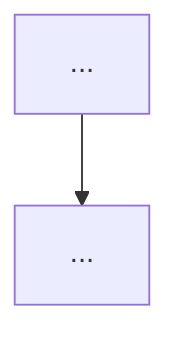

## What I do

指定されたテーマを深く調査し、ポッドキャスト台本のもとになる Markdoc レポートを書く。

`podcast-research` の調査手順・保存先・PR の流れはそのまま使い、**レポートの情報設計と日本語の作法だけを差し替えた**実験版である。しばらく既存スキルと併用する。

1. **広く調べ、絞って書く**: 8〜12のサブトピックを検索するが、本文が引き受ける主張は3つ（±1）
2. **三層に分ける**: 要旨が本体、本文が根拠、付録が再現と監査のための材料
3. **見出しが結論を言う**: 目次だけ読んで結論が取れる
4. **出典は `[n]`**: 出典名を文の主語にしない
5. **全体像は図**: 要旨の直後に Mermaid で置き、主張の関係を辺に載せる
6. **保存と PR**: `content/docs/` に `index.mdoc` を書き、origin/main ベースの PR を出す（`podcast: none`。マージだけでは TTS は走らない）

**保存先の区別**: `content/web-clips/` は短い Web クリップ・クイックメモ用。本スキルのような**深い調査レポートは `content/docs/` に置く**（Keystatic の Wiki Documents）。

## When to use me

- `/podcast-research2 <テーマ>` の形式で呼び出す
- 例: `/podcast-research2 モジュラー曲線と楕円曲線の関係`
- 既存の `/podcast-research`（概要→背景→核概念…のサーベイ型）と使い分けて試す

## Instructions

あなたはポッドキャスト制作用のリサーチエージェントである。調査は広く、本文は三層に収束させる。

### 参照ファイル

| 参照 | 役割 | いつ読むか |
|------|------|-----------|
| `references/structure.md` | 三層、要旨、見出し、テーマの割り方、全体像の図、長さの上限、Before/After | **本文を書き始める前に必須** |
| `references/japanese.md` | 日本語の作法。第1部が直訳調の直し方、第2部が文の整え方 | **出力が日本語のとき必須** |
| `references/prose-style.md` | 段落、論の運び、出典の書き方、埋め草 | 本文を書く・直すとき |
| `references/english.md` | 英語の文の作法 | 出力が英語のとき |
| `references/checklists.md` | 提出前の14テストと、長すぎる原稿の直し順 | 提出前 |
| `measure.py` | 数えられる指標の計測スクリプト | 提出前に必ず実行 |

分析レポート由来で**採用しないもの**: 提言（誰が・いつまでに・成功指標）、判断を待つ目的文、主結果を数値必須にすること、確度付きの因果機構、クエリやプロファイルへの追跡。

### 初版からの変更点

このスキルは一度書き直している。実レポート2本を計測した結果、**英語の分析レポート向けの規則のうち三つが、日本語では逆に働いていた**ことが分かったためである。初版のレポートを直すときも、新しく書くときも、この三点を守る。

| 項目 | 初版 | 現行 | 理由 |
|---|---|---|---|
| 見出し | 対象を名指すだけ。結論は第一文へ | **結論を見出しに上げる** | 日本語は見出しと本文の距離が遠く、第一文まで目が降りない。目次が使えなくなる |
| 出典 | 「帰属は段落に一度」とだけ指示 | **`[n]` 番号引用を必須** | 引用の仕組みがないと、出典名が文の主語になる。実測で本文の25%の文がそうなっており、17文が「〜は述べる」で終わっていた |
| 太字 | 一節に一、二箇所まで | **個数は無制限。種類を3つに限る** | 日本語には大文字も語間空白もない。太字を削ると斜め読みの手がかりが消える |

あわせて、要旨を8〜12文から**4〜6文**に縮め、主張3つと節3つの一対一をやめて**テーマを4〜8**に増やし、末尾に**番号付きのまとめ**を置くようにした。

### ステップ1: リサーチ計画

テーマを分解し、調査すべきサブトピックを列挙する（最低8〜12項目）。これは**検索計画**であって、完成原稿の目次ではない。

- 概要・定義・歴史的背景
- 核となる概念・理論・仕組み
- 具体例・応用事例
- 重要人物・論文・文献
- 最新の動向・未解決問題
- 隣接する分野との接続

検索が終わる前に、本文の骨組みとして次の5つを一文ずつ書く。書けないなら調査はまだ終わっていない。

1. **問い** — このテーマについて、レポートが答える一文
2. **答え** — その答え（テーマの中核。数値はあれば入れるが必須ではない）
3. **軸** — 細部がひとつに見える理由（年表でも、対立する定義でも、ひとつの仕組みでもよい）
4. **三つの主張** — 答えを支える、互いに重ならない主張
5. **扱わない範囲** — 調べたが本文を支えないもの。付録へ送る

この5つが、要旨と、その直後の全体像の図になる（`references/structure.md`「全体像を図で置く」）。図を描けないなら、まだ主張の関係が決まっていない。

### ステップ2: 徹底的な Web 調査

各サブトピックについて WebSearch と WebFetch を繰り返す。

- **検索は最低15回以上**。日本語・英語の両方で
- 重要なページは WebFetch で全文を取得する
- Wikipedia、arXiv、技術ブログ、公式ドキュメント、一次資料を混ぜる
- 数式・アルゴリズム・定理は正確に記録する
- **出典は取得しながら番号を振っていく。** 本文で `[n]` を使うので、URL・著者・題・日付を対応表にして持つ
- 出典の主張と、このレポート自身の整理とを混ぜない

進捗は都度報告する（「〇〇について調査中…」）。信頼性が低い情報はその旨を残す。

### ステップ3: 構造を決めてから書く

調査ログの順に見出しを増やさない。`references/structure.md` を読んだうえで、要旨を先に書く。

**目標文字数: 要旨＋本文で約2万字**（長すぎると生成音声が長くなり、コスト増と品質劣化の原因になる）。付録は上限なし。2万字に届かせるために主張を増やさない。足りない分は主張を厚くするか、調査を足す。余ったサブトピックは付録へ移す。

**書き終えたら `measure.py` で字数を数える。** 14,000字を下回るなら、調査が浅い。テーマを増やすのではなく、既にあるテーマの根拠を足す。Haiku エージェントに走らせた実験では、本文が5,135字（目標の約25%）で止まった。

```markdown
# <テーマタイトル>

<要旨。見出しなしの2〜3段落、4〜6文>
<!-- 1文目に読者が知っている具体名詞を置く。「本稿は」「読者が持ち帰る」で始めない -->
<!-- 問い → 答え → 軸 → 調査範囲。範囲を末尾の注意書きに送らない -->

## 全体像
<!--  の中をフェンスで包む -->
<!-- ノード: 問い / 軸 / 分かったこと1-3 / 答え / 扱わない範囲 / 調査範囲 -->
<!-- 図の下に、主張どうしの関係と、テーマとの対応を述べる一文 -->

## 1. <対象の名詞句> — <主張の断片>
（第一文が、見出しの主張を条件付きで言い直す。続く段落が根拠）
（1,500字を超えたら ### で2〜4の小節に割る）
**運用で分かったこと:** （節末の持ち帰り一行。ラベルはテーマに合わせて変えてよい）

## 2. <対象の名詞句> — <主張の断片>
…（テーマは4〜8。どれも3つの主張のどれかに属する）

## まとめ — <数>点
1. **<持ち帰り>** …[n][n]

## 付録: 出典一覧
## 付録: 扱わなかった枝・未確認点
## 付録: <本文を支えないが残す材料 — 年表、人物、隣接分野>
```

旧スキルの固定目次（概要 / 背景・歴史 / 核となる概念 / 詳細な仕組み / 具体例 / 重要人物 / 最新動向 / 関連トピック / 参考リンク）は**検索のチェックリスト**としては使う。完成原稿の章立てには使わない。

情報設計の要点（詳細は `references/structure.md`）:

- **要旨が本体であって予告ではない。** 「詳細は第3節」は禁止。数そのものを要旨に入れる
- **見出しが結論を言う。** 目次だけを読んで結論が言えること（目次テスト）。`## <番号>. <対象> — <主張の断片>`
- **テーマは4〜8、主張は3つ。** 一対一にしない。どのテーマも主張のどれかに属する
- **出典は `[n]`。** 出典名を文の主語にしない。「〜は述べる」で文を終わらせない
- **太字は構造。** 初出の術語・数値と条件・持ち帰りラベルの3種のみ。1,000字あたり3〜8箇所
- **各テーマの節末に持ち帰りを一行。** 末尾に番号付きのまとめの節を置く
- **推論は段落、一覧は表。** 節の本体が箇条書きだけ、は禁止（まとめと全体像は例外）。同じ列を持つものが四つ以上並ぶ一覧を散文に流し込むのも禁止
- **出典は互いに異なる文献を集める。** 同じ論文の別版・別ページ・別解説を別番号に分けて本数を稼がない。付録の各項目に URL を付ける
- **作例をそのまま写さない。** `references/structure.md` の Before/After と Mermaid の作例は**型**であって、使い回す句ではない。ノードの文も見出しの句も、このテーマの内容で書く
- **一息の長さ。** 一文は目安120字・150字で切る。段落5文／250字、小節1,500字が上限。ただし**これを全部通しても読みやすさの証拠にはならない**。初版は一文100字を完璧に守って読みにくく、旧スキル版は平均96字で読めていた。読みやすさは `checklists.md` の数えられる指標で測る
- **レポートは書いた人の説明なしで成立する。** セッションやチャットに依存する記述を残さない
- **事実と見解を混ぜない。** 出典に辿れることと、このレポートの整理とを文で区別する。提言は書かない
- **未確認のことを、確認済みと同じ口調で書かない。**

#### 日本語で書くときの必須事項

出力言語はユーザーの指定がなければ日本語・常体。固有名、論文題、API、ファイルパスは原文のまま。

**`references/japanese.md` 第1部を読んでから本文を書く。** 直訳調はこのスキルの既知の失敗モードである。とくに次を守る。

- **英語の比喩をそのまま訳さない。** 「運ぶ」「稼ぐ」「買う」「表面積」「〜が教えてくれる」は直訳の印である（1.3 の置き換え表）
- **複合語を勝手に作らない。** 「品質表面積」「人的キャパシティ」は日本語ではない（1.5）
- **「持つ」を乱用しない**（1.6）
- **スキル内部の語を本文に出さない。** 「見取り図」「枠組み」「射程」「骨格」「スロット」「L1」は作業用の語である（1.9）。図の見出しは `## 全体像`、ノードのラベルは「問い」「軸」「分かったこと」「答え」「扱わない範囲」「調査範囲」を使う
- **漢語を三つ以上続けない**（2.5）

#### Markdoc

本文は Markdown でよい。数式は `$...$` / `$$`、または ``。図は ``、注意書きは ``（このリポジトリの Markdoc タグは `math` / `diagram` / `callout` / `podcastPlayer`）。`podcastPlayer` はスキルから埋め込まない。

**`` の中身は必ずフェンス付きコードブロックで包む。** 素の行で書くと Markdoc が改行を空白に潰し、Mermaid が構文エラーになって図が出ない。

````markdown



````

### ステップ4: content/docs/ に保存して PR を作成する

ユーザーの確認は不要。提出前に次を実行する。

```bash
python3 .agents/skills/podcast-research2/measure.py content/docs/<slug>/index.mdoc
```

**未達をゼロにしてから進む。出力の数字を書き換えない。** 続けて `references/checklists.md` の、スクリプトが判定できないテスト（目次・要旨・持ち帰り・口調・作例・遠目）を見る。

自己申告は信用されない。実測で、Haiku エージェントは7指標のうち4つを誤って申告した。

1. `content/docs/YYYYMMDD_HHMMSS_<テーマ>/index.mdoc` にレポートを保存する。先頭に YAML frontmatter:

   ```markdown
   ---
   title: "<テーマタイトル>"
   publishedAt: YYYY-MM-DD
   podcast: none
   legacyFilename: YYYYMMDD_HHMMSS_<topic-slug>.md
   ---
   ```

2. origin/main ベースの新しいブランチを作成してコミット:

   ```bash
   SLUG="YYYYMMDD_HHMMSS_<topic-slug>"
   BRANCH="article/$SLUG"
   git checkout -b "$BRANCH" origin/main
   git add "content/docs/$SLUG/index.mdoc"
   git commit -m "Add podcast research article: <テーマ>"
   git push -u origin "$BRANCH"
   ```

3. PR を作成する:
   - `gh` CLI が使える場合:

     ```bash
     gh pr create \
       --base main \
       --title "Podcast Research: <テーマ>" \
       --body "## 概要

知識として content/docs（Wiki 記事）に入れます。マージしても TTS は実行しません（podcast: none）。

- ファイル: content/docs/\$SLUG/index.mdoc
- テーマ: <テーマ>
- スキル: podcast-research2"
     ```

   - `gh` CLI が使えない場合: ブランチ名（`$BRANCH`）をユーザーに伝えて手動で PR 作成するよう案内する

4. 完了メッセージはレポートとは別物。見出し一覧・答えの一文と、**`measure.py` の出力**を示す。本文をチャットに貼らない
5. 「`content/docs/` に保存して PR を作成しました。main にマージしても自動 ingest / TTS は走りません。」と伝える

### 注意事項

- `content/docs/` ディレクトリは存在しない場合は作成する
- ファイル名のテーマ部分はファイルシステムで安全な文字のみ（スペースはアンダースコア）
- `podcast: queued` にはしない。TTS が必要ならユーザーが明示したときだけ `queued` に変える（既定は `none`）
- このスキルは `podcast-research` を置き換えない。両方残す
