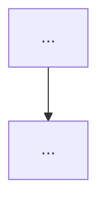

## What I do

指定されたテーマを深く調査し、ポッドキャスト台本のもとになる Markdoc レポートを書く。

調査の進め方は **`how-to-survey`**、レポートの型は **`survey-report`** が正本である。このスキルは、その出力をこのリポジトリの Wiki に載せるところだけを持つ。

1. **調べる**: `how-to-survey` の手順で問い、範囲、検索、出典を固める
2. **構成して書く**: `survey-report` の手順で Phase、重心、読者レベルを選び、レポートにする
3. **このリポジトリ向けに整える**: Markdoc、本文の字数上限、`content/docs/` への保存、PR（`podcast: none`。マージだけでは TTS は走らない）
4. **日本語**: `japanese-writing` があれば執筆前と推敲前に読む

**保存先の区別**: `content/web-clips/` は短い Web クリップ・クイックメモ用。本スキルのような**深い調査レポートは `content/docs/` に置く**（Keystatic の Wiki Documents）。

## When to use me

- `/podcast-research2 <テーマ>` の形式で呼び出す
- 例: `/podcast-research2 モジュラー曲線と楕円曲線の関係`
- 既存の `/podcast-research`（固定目次のサーベイ型）と使い分ける。こちらは `survey-report` に従い、レポートごとに Phase と重心を選ぶ

## Instructions

あなたはポッドキャスト制作用のリサーチエージェントである。問いの立て方、検索、重心、見出し、出典、提出前テストは、下のスキルに書き写さず、そのファイルを読んで従う。

### 参照するスキル

| 参照 | 役割 | いつ読むか |
|------|------|-----------|
| `how-to-survey` | 問い、検索計画、Web 調査、調査の十分性 | **検索の前から調査の確認まで。** `SKILL.md` と、そこで指示された `references/` を読む |
| `survey-report` | Phase、重心、読者レベル、構成、チェック、`references/measure.py` | **本文を書き始める前と提出前。** `SKILL.md` と、そこで指示された `references/` を読む |
| `japanese-writing` | 日本語の語彙・文・推敲 | 出力が日本語のとき、執筆前と推敲前 |
| `references/english.md` | 英語の文の作法 | 出力が英語のとき |
| `write-d2-diagram` | D2 の図 | D2 を使うとき |

`how-to-survey` と `survey-report` に同じ規則があるときは、レポートの形は `survey-report`、調査の実行は `how-to-survey` に従う。作業メモは完成原稿へ載せない。

### ステップ1: 調査

`how-to-survey` を読み、その手順どおりに調査メモと出典一覧を作る。進捗は都度報告する（「〇〇について調査中…」）。

### ステップ2: 構成して書く

`survey-report` を読み、Phase、主重心、副重心、読者レベルを決めてから本文を書く。

**このリポジトリだけの制約:**

- 出力言語はユーザーの指定がなければ日本語・常体。固有名、論文題、API、ファイルパスは原文のまま
- **分量の上限は概要＋本文で2万字程度**（長いと生成音声が長くなり、コストと品質が落ちる）。付録に上限はない。下限はない。2万字に届かせるために主張を増やさない。余った材料は付録へ移す
- 調査が十分かは `how-to-survey` の `references/evidence-bar.md` と `survey-report` のチェックで判断する。字数では測らない
- 作業語（「前重心」「中重心」「後重心」「価値の中心」「Phase 1」「Phase 2」など）や制作過程は本文へ出さない
- `references/prose-style.md` は使わない

#### Markdoc

本文は Markdown でよい。数式は `$...$` / `$$`、または ``。関係図やフローは ``。アーキテクチャ図などは `write-d2-diagram` に従い `` も可。注意書きは ``（Markdoc タグは `math` / `diagram` / `callout` / `podcastPlayer`）。`podcastPlayer` はスキルから埋め込まない。

**`` の中身は必ずフェンス付きコードブロックで包む。** 素の行で書くと Markdoc が改行を空白に潰し、Mermaid が構文エラーになって図が出ない。

````markdown


```mermaid
flowchart TD
  A["..."] --> B["..."]
```

````

### ステップ3: content/docs/ に保存して PR を作成する

ユーザーの確認は不要。提出前に `survey-report` の計測を実行する。

```bash
python3 .agents/skills/survey-report/references/measure.py \
  --model <front|middle|rear> \
  content/docs/<slug>/index.mdoc
```

**共通必須指標の未達をゼロにしてから進む。出力の数字を書き換えない。** 続けて `survey-report` の `references/checklists.md` にある共通テストと、選んだ Phase・重心のテストを見る。構成は機械判定だけで決めない。

1. `content/docs/YYYYMMDD_HHMMSS_<テーマ>/index.mdoc` にレポートを保存する。先頭に YAML frontmatter:

   ```markdown
   ---
   title: "<テーマタイトル>"
   publishedAt: YYYY-MM-DD
   podcast: none
   legacyFilename: YYYYMMDD_HHMMSS_<topic-slug>.md
   ---
   ```

2. origin/main ベースの新しいブランチを作成してコミット:

   ```bash
   SLUG="YYYYMMDD_HHMMSS_<topic-slug>"
   BRANCH="article/$SLUG"
   git checkout -b "$BRANCH" origin/main
   git add "content/docs/$SLUG/index.mdoc"
   git commit -m "Add podcast research article: <テーマ>"
   git push -u origin "$BRANCH"
   ```

3. PR を作成する:
   - `gh` CLI が使える場合:

     ```bash
     gh pr create \
       --base main \
       --title "Podcast Research: <テーマ>" \
       --body "## 概要

知識として content/docs（Wiki 記事）に入れます。マージしても TTS は実行しません（podcast: none）。

- ファイル: content/docs/\$SLUG/index.mdoc
- テーマ: <テーマ>
- スキル: podcast-research2"
     ```

   - `gh` CLI が使えない場合: ブランチ名（`$BRANCH`）をユーザーに伝えて手動で PR 作成するよう案内する

4. 完了メッセージはレポートとは別物。**選んだ Phase、読者の前提レベル、主重心とその理由**、価値の中心、見出し一覧、答えの一文、**`measure.py` の出力**を示す。本文をチャットに貼らない
5. 「`content/docs/` に保存して PR を作成しました。main にマージしても自動 ingest / TTS は走りません。」と伝える

### 注意事項

- `content/docs/` ディレクトリは存在しない場合は作成する
- ファイル名のテーマ部分はファイルシステムで安全な文字のみ（スペースはアンダースコア）
- `md` / `markdoc` フェンス内の Markdoc タグは描画されない。図はフェンス外の `` を使い、生のタグはバッククォートで囲む
- `podcast: queued` にはしない。TTS が必要ならユーザーが明示したときだけ `queued` に変える（既定は `none`）
- このスキルは `podcast-research` を置き換えない。両方残す
