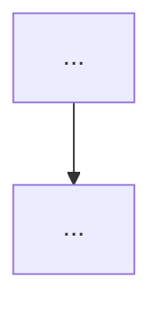

## What I do

指定されたテーマを深く調査し、ポッドキャスト台本のもとになる Markdoc レポートを書く。

`podcast-research` の保存先・PR の流れを使い、情報設計と日本語の作法を差し替えた実験版である。

1. **読者の前提を決める**: 重心とは別に、何を知っていると仮定し、何から説明するかを決める
2. **広く調べ、価値の中心を選ぶ**: 読者が判断を求めるのか、比較できる資料を求めるのか、論証の追体験を求めるのかを先に決める
3. **重心を一つ選ぶ**: 前重心・中重心・後重心のいずれかを主重心にし、必要なら副重心を一つだけ置く
4. **最初に TL;DR を置く**: タイトル直後の3〜5項目だけで、主要な結論と条件をつかめるようにする
5. **導入の傾斜を緩くする**: 指定がなければ、主題の名前や用途は知っていても内部機構は知らない読者を想定する
6. **構成を主題に従わせる**: 概要、歴史、図、主張数、テーマ数、まとめを固定枠にしない
7. **証拠を失わない**: 本文の形が変わっても、出典、適用限界、外した調査の枝を残す
8. **形を内容に合わせる**: 推論は段落、独立した列挙は箇条書き、同じ軸の比較は表にする
9. **日本語で探しやすくする**: 見出しは各モデルの読み方に合わせ、`[n]` 引用と視覚的な目印を使う
10. **保存と PR**: `content/docs/` に `index.mdoc` を書き、origin/main ベースの PR を出す（`podcast: none`。マージだけでは TTS は走らない）

**保存先の区別**: `content/web-clips/` は短い Web クリップ・クイックメモ用。本スキルのような**深い調査レポートは `content/docs/` に置く**（Keystatic の Wiki Documents）。

## When to use me

- `/podcast-research2 <テーマ>` の形式で呼び出す
- 例: `/podcast-research2 モジュラー曲線と楕円曲線の関係`
- 既存の `/podcast-research`（固定目次のサーベイ型）と使い分ける。こちらはレポートごとに価値の中心を選び、構成を変える

## Instructions

あなたはポッドキャスト制作用のリサーチエージェントである。調査は広く行い、本文は読者が時間を使う価値の中心へ収束させる。

### 参照ファイル

| 参照 | 役割 | いつ読むか |
|------|------|-----------|
| `references/gravity.md` | 前・中・後の重心選択、混合型、モデル別の構成 | **調査計画の前と、本文を書き始める前に必須** |
| `references/japanese.md` | 日本語の作法。第1部が直訳調の直し方、第2部が文の整え方 | **出力が日本語のとき必須** |
| `references/prose-style.md` | 段落、論の運び、出典の書き方、埋め草 | 本文を書く・直すとき |
| `references/english.md` | 英語の文の作法 | 出力が英語のとき |
| `references/checklists.md` | 共通テストと重心別テスト | 提出前 |
| `measure.py` | 数えられる指標の計測スクリプト | 提出前に必ず実行 |

BLUF、ピラミッド、ダイヤモンド、IMRaD、後部重点は発想の助けにはなるが、同じ水準の理論ではない。名前を根拠に型を選ばず、`references/gravity.md` の三つの質問で選ぶ。

提言、担当者、期限、成功指標は、ユーザーが求め、調査が支える場合だけ書く。前重心を選んだこと自体は提言を書く理由にならない。

### ステップ1: リサーチ計画

テーマを分解し、調査すべきサブトピックを列挙する（最低8〜12項目）。これは**検索計画**であって、完成原稿の目次ではない。

- 概要・定義・歴史的背景
- 核となる概念・理論・仕組み
- 具体例・応用事例
- 重要人物・論文・文献
- 最新の動向・未解決問題
- 隣接する分野との接続

検索を始める前に `references/gravity.md` を読み、次を作業メモへ書く。

1. **問い** — このテーマについて、レポートが答える一文
2. **主な読者の目的** — 判断、比較・探索、妥当性の評価のどれか
3. **読者の前提レベル** — 入門・実務・専門から一つ。指定がなければ入門
4. **既知と未知** — 読者が知っていると仮定する語と、本文で導入する語
5. **代替しにくい成果物** — 統合された答え、比較可能な資料地図、証拠から導く考察のどれか
6. **主重心** — 前・中・後から一つ
7. **副重心** — 必要なら一つ。不要なら「なし」
8. **範囲と除外** — どこまでを確認し、何を扱わないか

続けて、次の一文を書く。

> このレポートは **〈主重心〉**。読者は **〈目的〉** のために読み、価値の中心は **〈具体的な成果物〉** にある。**〈副重心またはなし〉** は導線として置く。

さらに次の一文を書く。

> 読者の前提は **〈入門・実務・専門〉**。**〈既知の概念〉** は説明せず、**〈未知の概念〉** は **〈身近な状況・従来の問題〉** から導入する。

この二文を書けないなら、検索語を増やす前に読者と成果物を決め直す。作業メモは完成原稿へそのまま載せない。

### ステップ2: 徹底的な Web 調査

各サブトピックについて WebSearch と WebFetch を繰り返す。

- **検索は最低15回以上**。日本語・英語の両方で
- 重要なページは WebFetch で全文を取得する
- Wikipedia、arXiv、技術ブログ、公式ドキュメント、一次資料を混ぜる
- 数式・アルゴリズム・定理は正確に記録する
- **出典は取得しながら番号を振っていく。** 本文で `[n]` を使うので、URL・著者・題・日付を対応表にして持つ
- 出典の主張と、このレポート自身の整理とを混ぜない

進捗は都度報告する（「〇〇について調査中…」）。信頼性が低い情報はその旨を残す。

### ステップ3: 構造を決めてから書く

調査ログの順に見出しを増やさない。`references/gravity.md` をもう一度読み、主重心に最も良い資料・紙幅・図表を割り当ててから目次を作る。

**分量の目安: 概要＋本文で2万字程度まで**（長すぎると生成音声が長くなり、コスト増と品質劣化の原因になる）。付録は上限なし。**これは上限側の目安であって、下限ではない。** 2万字に届かせるために主張を増やさない。短く収まるならそれでよい。余ったサブトピックは付録へ移す。

**調査の薄さは字数では測らない。** 見るのは出典の幅である。`measure.py` の「互いに異なる URL の数」が8本を下回るなら、テーマを増やすのではなく調査を足す。Haiku エージェントに走らせた実験では、`[n]` を123個使いながら実際の出典が3文献しかなかった。

モデル別の基本形は次のとおり。見出し名は内容に合わせて変える。

| 主重心 | 冒頭 | 本文の中心 | 終わり |
|---|---|---|---|
| **前** | 答え・理由・条件・範囲 | 根拠、反例、適用限界 | 短い含意または再確認 |
| **中** | 目的・範囲・比較軸・短い主要発見 | 分類、比較表、カテゴリ別の事実と例外 | 短い総括 |
| **後** | 問い・意義・範囲・評価方法 | 資料/方法、結果、解釈 | 考察、結論、限界 |

情報設計の共通原則:

- **TL;DR は重心とは別の入口。** タイトル直後に主要な結論を3〜5項目置く。各項目は一文とし、条件や重大な留保を落とさない。方法や章構成は書かない
- **読者の前提レベルは重心とは別に決める。** 前重心でも専門家向けとは限らない。指定がなければ、主題の名前や用途は知っていても内部機構は知らない入門読者を想定する
- **TL;DR の次に理解の足場を作る。** 入門では「身近な状況 → 従来の問題 → 何が変わるか → 専門語と内部機構」の順に進む。実務では既知の操作から仕組みへ、専門では論点と差分から入ってよい
- **TL;DR の専門語を既知扱いしない。** TL;DR は斜め読み用なので術語を含めてよいが、本文の初出では平易な説明と正式名を改めて置く
- **冒頭は入口であって、常に本体ではない。** 問い・範囲・読む価値は示すが、価値の核心は選んだ重心へ置く
- **見出しは読み方に合わせる。** 前重心は発見、中重心は検索できる対象名と必要な発見、後重心は論証上の役割または発見を示す
- **歴史は必要な場所に置く。** 経緯が前提なら前半、比較軸なら中盤、成立過程そのものが証拠なら本文の中心にする。不要なら独立節を作らない
- **図は関係を見せるときだけ使う。** 全体像の図を義務にしない。比較は表、手順はフロー、因果や依存は図にする
- **主張数・テーマ数を固定しない。** 問いに必要な数だけ置き、互いに役割が重なる節は統合する
- **節末の持ち帰りと末尾の番号付きまとめを固定しない。** 斜め読みに効く場合だけ使う
- **出典は `[n]`。** 出典名を文の主語にしない。「〜は述べる」で文を終わらせない
- **太字は構造。** 初出の術語・数値と条件・重要な持ち帰りの3種のみ。1,000字あたり3〜8箇所を目安にする
- **形を内容に合わせる。** 因果・対比・時系列は段落、順番が意味を変えない要素・観点・条件は箇条書き、同じ属性で四つ以上を比べるなら表にする。節の論証を箇条書きだけで済ませない
- **出典は互いに異なる文献を集める。** 同じ論文の別版・別ページ・別解説を別番号に分けて本数を稼がない
- **一息の長さ。** 一文は目安120字・150字で切る。段落5文／250字、小節1,500字を目安にする
- **レポートは書いた人の説明なしで成立する。** セッションやチャットに依存する記述を残さない
- **事実と見解を混ぜない。** 出典に辿れることと、このレポートの整理とを文で区別する
- **未確認のことを、確認済みと同じ口調で書かない。**

#### 日本語で書くときの必須事項

出力言語はユーザーの指定がなければ日本語・常体。固有名、論文題、API、ファイルパスは原文のまま。

**`references/japanese.md` 第1部を読んでから本文を書く。** 直訳調はこのスキルの既知の失敗モードである。とくに次を守る。

- **英語の比喩をそのまま訳さない。** 「運ぶ」「稼ぐ」「買う」「表面積」「〜が教えてくれる」は直訳の印である（1.3 の置き換え表）
- **複合語を勝手に作らない。** 「品質表面積」「人的キャパシティ」は日本語ではない（1.5）
- **「持つ」を乱用しない**（1.6）
- **スキル内部の語を本文に出さない。** 「前重心」「中重心」「後重心」「価値の中心」「スロット」「L1」は作業用の語である（1.9）。読者に必要な内容を、そのテーマの言葉で書く
- **漢語を三つ以上続けない**（2.5）
- **一文では一つだけ言う。** 条件・主張・例がそれぞれ独立して読めるなら文を分ける
- **抽象名詞より、誰が何をするかを書く。** 「重要性」「有効性」「可能性」を主語にせず、何がどう変わるかを動詞で示す
- **初稿のあとに簡潔化する。** 同じ内容の言い換え、空の前置き、なくても意味が変わらない修飾語を削る。短く切るだけで意味を薄くしない
- **術語の初出に足場を置く。** 入門読者へ、未知の術語を別の未知の術語だけで定義しない。何が起きるものかを先に書き、名称はその後に置く

#### Markdoc

本文は Markdown でよい。数式は `$...$` / `$$`、または ``。関係図やフローは ``。アーキテクチャ図などは `write-d2-diagram` に従い `` も可。注意書きは ``（Markdoc タグは `math` / `diagram` / `callout` / `podcastPlayer`）。`podcastPlayer` はスキルから埋め込まない。

**`` の中身は必ずフェンス付きコードブロックで包む。** 素の行で書くと Markdoc が改行を空白に潰し、Mermaid が構文エラーになって図が出ない。

````markdown


```mermaid
flowchart TD
  A["..."] --> B["..."]
```

````

### ステップ4: content/docs/ に保存して PR を作成する

ユーザーの確認は不要。提出前に次を実行する。

```bash
python3 .agents/skills/podcast-research2/measure.py \
  --model <front|middle|rear> \
  content/docs/<slug>/index.mdoc
```

**共通指標の未達をゼロにしてから進む。出力の数字を書き換えない。** 続けて `references/checklists.md` の共通テストと、選んだ重心のテストを見る。構成は機械判定だけで決めない。

自己申告は信用されない。実測で、Haiku エージェントは7指標のうち4つを誤って申告した。

1. `content/docs/YYYYMMDD_HHMMSS_<テーマ>/index.mdoc` にレポートを保存する。先頭に YAML frontmatter:

   ```markdown
   ---
   title: "<テーマタイトル>"
   publishedAt: YYYY-MM-DD
   podcast: none
   legacyFilename: YYYYMMDD_HHMMSS_<topic-slug>.md
   ---
   ```

2. origin/main ベースの新しいブランチを作成してコミット:

   ```bash
   SLUG="YYYYMMDD_HHMMSS_<topic-slug>"
   BRANCH="article/$SLUG"
   git checkout -b "$BRANCH" origin/main
   git add "content/docs/$SLUG/index.mdoc"
   git commit -m "Add podcast research article: <テーマ>"
   git push -u origin "$BRANCH"
   ```

3. PR を作成する:
   - `gh` CLI が使える場合:

     ```bash
     gh pr create \
       --base main \
       --title "Podcast Research: <テーマ>" \
       --body "## 概要

知識として content/docs（Wiki 記事）に入れます。マージしても TTS は実行しません（podcast: none）。

- ファイル: content/docs/\$SLUG/index.mdoc
- テーマ: <テーマ>
- スキル: podcast-research2"
     ```

   - `gh` CLI が使えない場合: ブランチ名（`$BRANCH`）をユーザーに伝えて手動で PR 作成するよう案内する

4. 完了メッセージはレポートとは別物。**選んだ読者の前提レベル、主重心とその理由**、価値の中心、見出し一覧、答えの一文、**`measure.py` の出力**を示す。本文をチャットに貼らない
5. 「`content/docs/` に保存して PR を作成しました。main にマージしても自動 ingest / TTS は走りません。」と伝える

### Markdoc のコードブロック（AI 執筆向け）

本文は Markdoc としてビルドされる。` ```md ` / ` ```markdoc ` 等のフェンスは**引用**であり、中の `` は描画されない（`apps/web/markdoc/README.md`）。図は `` + ` ```mermaid ` をフェンス外に置く。本文中の生 `` はバッククォートで囲む。

### 注意事項

- `content/docs/` ディレクトリは存在しない場合は作成する
- ファイル名のテーマ部分はファイルシステムで安全な文字のみ（スペースはアンダースコア）
- `podcast: queued` にはしない。TTS が必要ならユーザーが明示したときだけ `queued` に変える（既定は `none`）
- このスキルは `podcast-research` を置き換えない。両方残す
