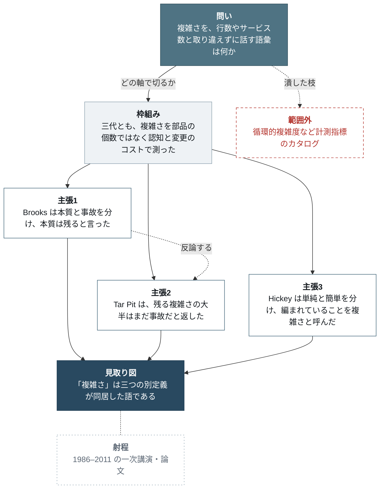

# リサーチレポートの構造

`SKILL.md` ステップ 3 の詳細。文書規模の原稿を書き始める前に読む。

分析レポート（prism `write-analysis-report`）から情報設計を借り、次は捨てた: 待っている判断、数値必須の主結果、確度付き因果、提言。骨格図は、Finding→Action の語彙をリサーチ用（問い・枠組み・主張・見取り図・範囲外・射程）に入れ替えたうえで採用する。残したのは三層、lede が本体であること、見出しと第一文の分担、調査順で章立てしないこと。

## 散文を書く前に構造を決める

失敗の典型は、調べながら書くことである。検索のたびに見出しが増え、完成原稿が発見順になる。多すぎると散らばるが同時に起きる。

段落を書く前に、次の 5 つを一文ずつ決める。

1. **問い。** ユーザーの言葉で。テーブル名や検索クエリの言葉で書かない。
2. **見取り図。** 答えを一文。書けないなら調査は終わっていない。配列では救えない。
3. **枠組み。** 細部が一つに見える理由。年表、対立する定義、一つの仕組み、どれでもよい。枠組みのない見取り図は目録になる。
4. **三つの主張。** 見取り図を支え、互いに重ならない。
5. **範囲外。** 調べたが本文を支えないもの。L3 へ送る。

L1 をこの 5 つから先に書く。L2 を先に書いて lede を後回しにすると、lede が各節の要約になり、答えにならない。

## 三層

どの材料がどの層かを、書く前に決める。

| 層 | 中身 | 分量 | 読者 |
|----|------|------|------|
| **L1 要旨** | なぜこのテーマか、中核の見取り図、それが一つに見える枠組み、レポートの主張 | 8〜12 文 | これだけ読んでポッドキャストの角度が決まる人 |
| **L2 主張** | 見取り図を支える 3（±1）の主張。主張ひとつにつき一節 | 主張を言い切るだけ書く | 見取り図が証拠に足るかを確認する人 |
| **L3 付録** | 年表の全項目、人物録、隣接分野、未確認点、出典、本文が使わなかった検索枝 | 上限なし | 再現・監査・次の調査をする人 |

三つの規則が層を化粧ではなく実体にする。

- **L1 がレポート本体**であり予告ではない。L1 だけで見取り図が言えること。
- **L1 に前方参照を置かない。** 「詳細は第 3 節」は層を壊す。数そのものを L1 に入れる。
- **主張が使わないものは L3。** 面白いだけでは L2 に残さない。支えるものだけ残す。

L2 の上限は主張の数であり、節の数ではない。四つを超える並行の糸はどれも残らない。五つ目以降は L3 の見出しへ送るか、次の調査にする。

上限は目標ではない。答えが二つの主張で足りるなら二つが正しい。禁止なのは**数に合わせるための合併**である。見出しに三つ並べた節、第一文が二つ主張する節は、分けた三節より読みにくい。

## L1: 要旨は抄録である

lede はレポート全体の縮小版である。ここで止めた読者が、先に論があることではなく、論そのものを言えること。

6 スロット、この順、8〜12 文を 2〜3 段落。スロットごとの文数は目安、合計が上限。

| # | スロット | 運ぶもの | 文数目安 |
|---|---------|----------|----------|
| 1 | **背景** | 読者がすでに認める状況。問いを生きさせる変化・発見 | 1–2 |
| 2 | **目的** | このレポートが何の理解を成立させるか。手段（「調査した」）ではなく成果物 | 1 |
| 3 | **見取り図** | テーマの中核。数値はあれば入れるが、なくてもよい | 1–2 |
| 4 | **範囲** | いつ・どの資料・どこまで。当てはまらない場所 | 1 |
| 5 | **枠組み** | 細部が一つに見える理由。確度ラベルは付けない | 1–2 |
| 6 | **主張** | このテーマをどう理解すべきか。読者が反対できる文 | 1 |

分析版の第 7 スロット（次の一手／提言）は置かない。聞き手が持ち帰る一点は、主張スロットに含める。残る未知は範囲スロットか L3 の「未確認点」へ。

四つの規則がスロットを正直にする。

- **目的は理解であり、方法ではない。** 「楕円曲線とモジュラー形式の対応が、なぜ数論の中心定理になったかを使える見取り図にする」は目的。「Web で調べた」は方法で、読者は知っている。
- **背景は問いを稼ぐ。分野の概説をしない。** 証拠が要る背景は、帽子を間違えた L2 の主張である。
- **主張は見取り図の言い換えではない。** 見取り図はテーマがどうなっているか。主張は、それに基づいて著者が引き受ける整理であり、反対できる文である。第 6 スロットを消しても何も失われないなら、言い換えだった。
- **L1 は 6 スロット以外を持たない。** 副次的な数字、捨てた検索枝、人物録は L2 と L3 へ。スロットを超えて膨らんだ lede は、過負荷そのものである。

**形。** 既定はラベルなしの散文。固定順がラベルの代わりになる。長くて読み返す原稿では、`要旨` を見出しにし、次のラベルを付けてよい。ラベルのあとに体言止めを置くのは抄録ではなく箇条書きである。各ラベルは完全な文を運ぶ。

日本語でラベルを出すときの語:

| スロット | 見出し語 | よくある失敗 |
|---------|----------|--------------|
| 背景 | 背景・経緯 | 分野の概説になり、証拠が要る記述が入る |
| 目的 | 目的 | 「〜を調査した」と手段を書く |
| 見取り図 | 見取り図 | 数値や定義だけを置き、テーマが何であるかが言えない |
| 範囲 | 適用範囲 | 末尾の「注意事項」に送られ、冒頭の読者の目に入らない |
| 枠組み | 枠組み | 「A と B は関係する」で止まり、なぜ一つに見えるかがない |
| 主張 | 主張 | 見取り図の言い換えになり、反対できる文になっていない |

`要旨`（または `サマリ`）を見出しに使い、ラベルをその下に並べる。ラベルなしでも順序は同じ。

見出し語だけ日本語にして中身を英語の直訳で埋めると、枠組みと主張の区別が最初に崩れる。「〜と考えられる」はどちらにも使える。枠組みは一つに見える理由を述べる文で、主張は「したがって〜として理解するのが足りる」「〜という通説は一次資料と合わない」のように反対できる形で書く。

### スロットを注釈した例

注釈は読むためのもので、提出原稿からは外す。運ぶのはスロットの順である。

```markdown
ソフトウェアが難しい、という直観は 1970 年代から何度も言葉にされてきた。[背景]
生成 AI は書くコストを下げたが、編むコストは下げていない。ポッドキャストで使うには、
「複雑さ」を行数やサービス数と取り違えない語彙が要る。[目的]

中核は三代である。Brooks は本質と事故を分け、Moseley & Marks は残っている複雑さの大半は
まだ事故だと返し、Hickey は単純と簡単を分けた。[見取り図]
本稿は 1986 年から 2011 年の一次講演・論文を軸にし、循環的複雑度のような計測指標のカタログは
扱わない。[範囲]
三人に共通するのは、複雑さを部品の個数ではなく認知と変更のコストとして扱ったことだ。
違うのは、Brooks が本質は残ると警告したのに対し、後の二人はまだ切り出せると見たことである。
[枠組み]

したがって複雑さの話は、計測可能なコード指標の話と、引き継ぎやすさの話を同じ語で混ぜると
壊れる。先にどの定義で話しているかを固定するのが、このテーマの使い方である。[主張]
```

目的文は判断（予算を倍にするか）ではなく、使える見取り図を名指す。主張は 94% のような主結果の言い換えではなく、テーマの使い方に立場を取る。

## L2: 主張ひとつにつき一節

各節は同じ四つの契約に従う。

1. **第一文が主張を述べる。** 話題でも方法でも「この節で扱うこと」でもない。主張。数があればその文に入れる。
2. **続く段落がそれを論じる。** 一方向: 根拠、その読み、予想される反論とその答え。主張 → 反論 → 撤回、の順は取らない。
3. **図と表は主張の根拠として、支える文の直後に置く。** 文が依存しない図は L3。
4. **節末は、この主張が見取り図に何を足すか。** 定義や年号で終わる節は尚未完。行動指示で終わらせない。

三つの構造的失敗を見る。

**主張の重なり。** 同じ根拠に乗る二節は、一つの主張を二度書いたもの。合併するか、本当に違う軸を見つける。

**主張の隙間。** 三つを合わせても見取り図に届かないとき、読者が欠けた段を自分で足す。その段を、lede か、依存する節の頭で口に出す。

**発見順の漏れ。** 「まず X を見たが何もなく、次に Y を見た」はログであり論ではない。行き止まりは L3 で、行き止まりだと分かる見出しの下へ。次の調査が同じ枝を掘らないために残す。

### 節は内部で割る

主張を三つに絞ると、一節が 4,000 字を超える。**主張がひとつであることと、節が一枚岩であることは別である。** 三つの壁は、九つの浅い節より読みにくい。

- **1,500 字を超えた節には `###` を入れる。** 一節あたり小節は 2〜4。それ以上に割れるなら、主張が二つ入っている。
- **小節の見出しも見出しである。** 名詞句で対象を名指し、単独見出しテストを通す。主張は小節の第一文へ。
- **小節は根拠の種類で割る。** 資料の出た順でも、検索の順でもない。「何が起きるか」「なぜそうなるか」「例外はどこか」「反対の事例」のように、節の主張に対する役割で割る。
- **節の最後の段落は `###` の下に置かない。** 見取り図への寄与を述べる段落は、小節を閉じたあと、節の直下に戻して置く。

### 列挙が素材のときは目録にする

「推論は段落、一覧は目録」は、**推論**を箇条書きに潰すなという規則であり、一覧を散文に潰せという規則ではない。資料が十本あってそれぞれが同じ形の情報（誰が・どこで・何を言ったか）を運ぶなら、それは一覧である。散文に流し込むと、読者は論ではなく書誌を追わされる。

- 同じ列を持つものが四つ以上並ぶなら**表**にする。出典一覧、層ごとの役割、対立する定義の比較。
- 表にしたら、散文では**そこから何が言えるか**だけを書く。表の中身を文で実況しない。
- **出典の帰属は段落に一度。** 「A は〜と述べる。B は〜と書く。C は〜と指摘する」と文ごとに主語が入れ替わる段落は、主語をレポート側に戻し、複数の出典が同じことを言っているなら一文にまとめて出典を並記する。

## L3: 付録は本文を短くするために稼ぐ

付録は捨て場ではない。本文を通読できる長さにするための層である。送るもの: 年表の全項目、人物録、隣接分野、本文が使わなかった検索枝、出典、長い引用。

付録の見出しも見出しである。読者が探しに来る名前を付け、判定は第一文へ。「効果がなかった先行研究」は述語が判定している。「検討した代替説明」と名付け、第一文で判定する。

長さのために消してはいけないものが二つある。調べて棄てた枝と、それを棄てた根拠。次の読者が同じ枝を掘る。もう一つは、L2 の各主張が乗る一次資料と出典。疑う読者が辿れなくなる。短くするとは、これを下の層へ移すことであり、消すことではない。本文と一緒に付録まで痩せた原稿は、簡潔ではなく証拠を失っている。

L1 から付録を参照しない。参照は L2 から下へだけ。

## 見出しは名付ける。第一文が主張する

見出しは、節が何についてかを特定する名詞句である。結論は本文の第一文へ、条件ごと。結論を見出しに上げると条件が落ち、標語になり、本文を直すたびにずれる。

**単独見出しテスト**: 本文なしで見出しだけ読む。賛成・反対できることを主張していれば失敗。節の対象を名指していれば通過。

型であり、使い回す句ではない。この表からコピーした見出しは、別の対象を名指す。

| 失敗 — 主張している | 通過 — 名指している |
|---|---|
| 本質的複雑さは銀の弾では消えない | Brooks の本質と事故 |
| 単純と簡単は別物である | Hickey の単純／簡単 |
| p 進整数は級数として書ける | p 進整数の表示 |
| 二次流通の伸び：既存会員が牽引 | 二次流通の需要構成 |

失敗の表面は三つ。主張する述語（「〜である」「〜が原因だ」「〜で決まっている」）、対象と判定を結ぶコロン、見出しに乗った発見の数。範囲を固定する数（「1986 年の定義」）はよい。発見の数は不可。

何も失われない。斜め読みは第一文が担う。**Lede-and-Titles テスト**は、すべての見出しとその第一文だけを順に読み、論になるかを見るテストである。結論を見出しに上げる許可ではない。主張する見出しは、このテストを通しながら文書を失敗させる。先に単独見出しテスト、そのあと Lede-and-Titles。

付録の見出しも同じ。行き止まりだと名付けるのは正しく、判定を述語にするのは正しくない。

## 骨格ブロック — 論の骨格は図で置く

L1 の直後、最初の L2 節の前に、**骨格**を置く。L2 が二節以上あるときは必須。

既定は**図**である。散文の索引は「主張を一行ずつ並べ、最後に関係を一文で述べる」形になり、その最後の一文が最初に落ちる。三行だけ書いて関係を書かない、本文は四節なのに骨格は三行のまま、という壊れ方をする。辺そのものが関係である図なら、関係は書き忘れようがない。

分析レポートの語彙（所見・機構・打ち手・確度）は使わない。リサーチレポートに打ち手ノードはなく、所見はデータ分析の観測事実でもない。使うのは、`SKILL.md` ステップ 1 で一文ずつ決めた 5 つに、射程を足した 6 種である。

| タグ | ノードが運ぶもの | 個数 |
|---|---|---|
| **問い** | レポートが答える一文 | 1 |
| **枠組み** | 細部が一つに見える理由。主張を束ねる軸 | 1 |
| **主張** | L2 の各節の主張を一行。節と一対一 | 3（±1） |
| **見取り図** | 問いへの答え。主張が収束する先 | 1 |
| **範囲外** | 調べたが本文を支えないもの。破線で鎖から外す | 0〜2 |
| **射程** | いつ・どの資料・どこまで。鎖全体にかかる | 1 |

**辺が関係を運ぶ。** 主張どうしを結ぶ辺には、関係を名指す語を必ず載せる（「前提を与える」「反論する」「条件を課す」「別方向から狭める」）。載せられないなら連鎖ではないので、辺を引かず `枠組み → 各主張` の並列だけを描く。連鎖か並列かを図の上で言えないなら、主張の切り方がまだ決まっていない。

### 書き方

`` を使う。Mermaid はこのリポジトリが既に読み込んでいる唯一の作図エンジンで、Keystatic の編集画面にも出る。

**中身は必ずフェンス付きコードブロックで包む。** `` の本体は Markdoc が Markdown として解釈するため、素の行で書くと改行が空白に潰れ、Mermaid が構文エラーになる（図が出ない）。フェンスで包んだときだけ改行がそのまま渡る。

````markdown




連鎖は Brooks から Tar Pit への一本だけで、Hickey は同じ枠組みに横から合流する。
````

`classDef` の 6 行と `class` の割り当ては、色がタグを運ぶので毎回そのまま写す。色は明背景・暗背景のどちらでも読めるよう固定してある。変える理由がない。

主張が連鎖するときは `C1 -->|"…"| C2 -->|"…"| C3` と辺で繋ぎ、並列のときは `F --> C1` `F --> C2` `F --> C3` の三本だけにする。どちらの形でも、主張はすべて `M` に入る。

### 規則

- **L2 の節と主張ノードは一対一。** 節が四つでノードが三つなら、辿り着けない節がある。節を増やしたら図も直す。
- **ノードは主張の一行。** 見出しのコピーでも、対象の名詞句でもない。40 字を超えると折り返しで読めなくなるので、超えたら主張を絞る。
- **ここにだけ存在する事実を置かない。** 骨格は索引であり、第三の本文ではない。L1 にも L2 にもない数字をノードに入れない。
- **図の下に一文を添える。** 関係（連鎖・並列・対比）を名指し、付録に何があるかを書く。図の実況はしない。
- **主張が二つ以下なら図を描かない。** 二行の文で足りるものに、描画と横スクロールのコストを払わない。そのときだけ、主張を文書順に並べたリストに関係の一文を添える形でよい。索引なので、そこは `prose-style.md` の箇条書き制限の例外になる。

## ページの見え方

読みにくさの大半は文体ではなく、**一息の長さ**である。上限は数えられる形で持つ。目標ではなく上限で、下回るのは自由である。

| 単位 | 上限 | 超えたときの直し |
|---|---|---|
| 一文 | 100 字（日本語） | 主語と述語を同時に視野に入れられない。`japanese.md` の手順で切る |
| 段落 | 5 文または 250 字 | 話題が二つ。継ぎ目で割る |
| 小節（`###`） | 1,500 字 | 根拠の種類で割るか、主張が二つ入っていないか見る |
| 節（`##`） | 1,500 字を超えたら `###` を入れる | 小節に割る。割れないなら主張が抽象すぎる |

残りは形の規則である。

- **つながりの語を段落の先頭へ。** 「したがって」「一方で」「ただし」「例外は」。文中に埋めると斜め読みに見えない。
- **中身に合わせて形を変える。** 比較は表、推論は散文、構造は図。一様なテクスチャはギアの変更を隠す。
- **太字で構造の代わりをしない。** 一節に一、二箇所（`prose-style.md` 5 節）。太字が節に十個あるなら、それは見出しが足りないという信号である。
- **遠目テスト。** 文字が潰れるまで縮小する。見出し・段落の空白・表・骨格図が帯になって見えること。真っ黒な長方形は、読む前に離脱する。

## レポートと完了メッセージは別物

レポートは論を運び、単独で立つ。完了メッセージは見取り図を一文で指し、ファイルを指す。一方を他方の半分にしない。チャットに本文を貼ると、長すぎるメッセージと、直した瞬間にずれる複製ができる。

行動や理解に必要な但し書きは**レポートの中**へ。メッセージが見出しの見つけ方を繰り返すのはよい。但し書きの居所にしてはならない。

このリポジトリでは層は物理的にも分かれる。

| 層 | 置き場所 |
|----|----------|
| L1 | 主 `.mdoc` の冒頭段落、およびユーザーへの完了メッセージ（見取り図の一文） |
| L2 | 同じファイルの主張の節 |
| L3 | 同じファイルの付録。出典 URL を含む |

## Before / After

### Before（旧スキルのサーベイ目次。発見順）

```markdown
# ソフトウェアの複雑さ

## 概要
本稿では複雑さの定義を調査する。Brooks、Out of the Tar Pit、Hickey…

## 背景・歴史
1968 年の NATO 会議…

## 核となる概念
### Brooks
### Out of the Tar Pit
### Hickey

## 詳細な仕組み・理論
循環的複雑度、結合度と凝集度…

## 具体例・応用事例
## 重要人物・文献
## 最新動向・未解決問題
## 関連トピック
## 参考リンク
```

読者は 9 節のあとで、テーマが何であるかを自分で組み立てる。各節が同じ大きさなので、何が支えで何が辞典か分からない。

### After

```markdown
# ソフトウェアの複雑さを定義した議論

<L1: 上記の 6 スロットを通した 2〜3 段落>

## 骨格
< — 問い・枠組み・主張 3・見取り図・範囲外・射程>
<図の下に、関係を名指す一文>

## Brooks の本質と事故
本質は絡み合った概念構造であり、言語やツールが消せるのは事故の側である。…

### 銀の弾の不在という主張
### 事故の側で実際に消えたもの

## Tar Pit の再定義
2006 年の再定義は、残っている複雑さの大半はまだ事故だ、と Brooks に返す。…

### 状態と制御の切り分け
### Brooks への反論が成り立つ範囲

## 単純と簡単
Hickey にとって複雑さは部品の少なさではなく、独立してよいものが編まれていることである。…

### 単純／簡単の軸
### 三つの定義が衝突する場所

## 付録: 一次資料と参考リンク
## 付録: 計測指標と隣接する語彙
## 付録: 検討した二次文献
```

何も消していない。人物録、循環的複雑度、関連トピックは L3 か、支える一文の中へ移った。変わったのは三つ。最初の段落が見取り図を答えること、骨格が図になって主張の関係が辺に乗ること、そして主張が三つでも節が一枚岩にならないことである。
