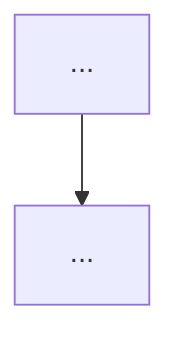

## What I do

URL を受け取り、元記事を取得して、`content/web-clips/` に日本語の要約クリップを書く。

このスキルが守るのは一点である。**要約が落としてはいけないのは記事の骨子である。** 何を主張し、なぜそう言えて、どこまで効くのか。この三つが立っていれば、字数が原文の1割でも要約として使える。三つのうちどれかが欠ければ、何字書いても使えない。

数値と固有名は、**骨子を裏付けるために**残す。骨子そのものではない。そして**具体が消えるのは、たいてい骨子をつかめていないことの症状である。** 何を主張した記事か言えないとき、人は「様々な手法が比較されている」と書く。そのとき一緒に名前と数値も落ちる。**順序を間違えない。骨子を先に決めれば、具体は自然に残る。**

1. **骨子を先に決める**: 主張・根拠・効く範囲を一文ずつ書けるまで、本文を書き始めない
2. **骨子は表、具体は裏付け**: 表に主張と値、本文に理由。同じ文を二度書かない
3. **見出しが結論を言う**: 目次だけ読んで記事の主張が取れる
4. **一記事一クリップ**: シリーズものでも記事ごとに分ける
5. **三つの層を混ぜない**: 記事が言ったこと / 記事が引いた出典 / クリップ時に足した補足
6. **逐語引用は3箇所まで**: 著者の言い回しそのものが情報になる文だけ引く
7. **保存と PR**: `content/web-clips/` に `index.mdoc` を書き、origin/main ベースの PR を出す（`podcast: none`）

**保存先の区別**: 自分で調べて書く深い調査レポートは `content/docs/`（`podcast-research2`）。**既にある一本の記事を読んで畳むのがこのスキル**で、行き先は `content/web-clips/` である。

## When to use me

- `/web-clip-summary <URL>` の形式で呼び出す
- 貼り付けた本文だけでもよい（その場合は URL 欄を空にし、出どころにその旨を書く）
- 複数 URL を渡されたら、記事ごとにクリップを分ける。まとめて一本にしない

## Instructions

あなたは Web クリップの要約エージェントである。原文を読み、落とすものと残すものを先に決め、それから書く。

### 参照ファイル

| 参照 | 役割 | いつ読むか |
|------|------|-----------|
| `references/compression.md` | 骨子の取り方と、何を落とし何を残すか。要約特有の失敗 | **原文を読み終えた直後に必須** |
| `references/structure.md` | クリップの骨格、骨子表、見出し、引用の作法、分量 | **書き始める前に必須** |
| `references/japanese.md` | 日本語の作法。第1部が直訳調の直し方、第2部が文の整え方 | **必須**（`podcast-research2` と同じ本体を指す） |
| `references/prose-style.md` | 段落、論の運び、出典の書き方 | 書く・直すとき |
| `references/checklists.md` | 提出前の9テスト | 提出前 |
| `measure.py` | 数えられる指標の計測スクリプト | 提出前に必ず実行 |

`japanese.md` と `prose-style.md` は `podcast-research2` の同名ファイルへのシンボリックリンクである。日本語の作法は二つのスキルで同じものを使う。片方だけ直すことがないように、実体はひとつにしてある。

### 要約の原則

**1. 落としてはいけないのは骨子である。**

骨子とは、**主張・根拠・効く範囲**の三つである。この三つを一文ずつ書けないなら、まだ要約できる状態にない。字数を削るのは骨子が立ってからで、順序を逆にすると何を削ってよいか分からなくなる。

**2. 具体は骨子の裏付けとして残す。抽象語に置き換えない。**

具体だけを守っても要約にはならない。三段階で見る。

- NG（骨子も具体もない）: 「複数のキャッシュ戦略を性能面で比較している」
- 不足（具体はあるが骨子がない）: 「p99 は LRU 0.8ms、Redis 3.2ms、Memcached 2.9ms」
- OK: 「**ネットワークを越えるだけで p99 が4倍になる**（LRU 0.8ms / Redis 3.2ms）ので、キャッシュは分散させないほうがよい」

数値を並べただけの2番目は、1番目より情報は多いが読者の判断には使えない。**主張に数値が付いて、初めて裏付けになる。**

**3. 記事の存在ではなく、記事の中身を書く。**

「本記事では〜について解説している」は要約ではない。目次の言い換えである。記事が何を主張し、その根拠が何で、どこまで効くのかを書く。

**4. 原文・原文が引く出典・クリップ側の補足を、表記で分ける。**

半年後に読み返したとき、どこまでが記事の主張でどこからが自分の考えかが分からないクリップは使えない。補足は `` に隔離する。

### ステップ1: 取得して、原文の輪郭をつかむ

WebFetch で全文を取る。取得に失敗したら、その旨を伝えて本文の貼り付けを求める。**取れなかった記事を、検索結果の断片や記憶で埋めない。**

取得したら、書き始める前に次の5つを一文ずつ書く。書けないなら、まだ読めていない。

1. **主張** — この記事が言っている一番強いことを一文で
2. **根拠の型** — 実測か、運用経験か、他文献の引用か、著者の意見か
3. **効く範囲** — どの条件で成り立ち、どこから外れるか（著者が認めている限界を含む）
4. **具体の在庫** — 落としてはいけない数値・固有名・バージョン・コマンドの一覧
5. **落とすもの** — 前置き、宣伝、言い換え、既知の一般論

**1〜3 が骨子である。ここが書けていないうちは 4 と 5 に進まない。** 落とすものの判断は骨子が決まってからでないとできない。`references/compression.md` の表を使う。

必要なら周辺を1〜3回だけ検索してよい（記事の日付、著者、記事が引いている論文の実体）。**それ以上は調査であって要約ではない。** 深掘りしたくなったら `podcast-research2` に切り替えるようユーザーに勧める。

### ステップ2: 分量を決める

**原文の 1/5 〜 1/3 を目安にする。** 元記事が 3,000字なら 600〜1,000字、20,000字なら 4,000〜6,500字。上限は 8,000字。

**下限はない。** 薄い記事を厚く要約しない。原文に数値も条件もなければ、クリップにも入らない。そのときは「原文が一般論にとどまる」と書く。

字数を埋めるために、原文にない知識を足さない。足したくなったら補足の callout に入れる。

### ステップ3: 書く

`references/structure.md` を読んでから書く。骨格は次のとおり。

```markdown
# <記事の主張を言うタイトル>

<要旨。見出しなし、3〜5文>
<!-- 1文目に、記事の主張そのものを置く。「本記事は」「この記事では」で始めない -->
<!-- 主張 → 根拠の型 → 効く範囲 の順。書誌情報は末尾の出どころへ -->

## 骨子
<!-- 3〜6行の表。列は 主張 / 根拠 / 効く範囲 を基本に、記事に合わせて変えてよい -->
<!-- 表には値を置く。理由は本文に置く。同じ文を二度書かない -->

## 1. <対象の名詞句> — <主張の断片>
（第一文が見出しの主張を条件付きで言い直す。続く段落が根拠と数値）

## 2. <対象の名詞句> — <主張の断片>
…（節は2〜6。原文の章立てをそのままなぞらない）

## この記事を疑うなら
<!-- 任意。根拠が薄い箇所、反例、著者の立場に由来する偏り。無ければ節ごと落とす -->

## 出どころ
- 元記事: <著者>, [題](URL)（媒体・日付）
- 記事が引いている出典: …


**クリップ時の補足（原文にない）**: …

```

情報設計の要点（詳細は `references/structure.md`）:

- **要旨が本体であって予告ではない。** 「詳細は後述」は禁止。数そのものを要旨に入れる
- **見出しが結論を言う。** `## <番号>. <対象> — <主張の断片>`。原文の見出しを訳しただけの見出しは落ちる
- **原文の章立てをなぞらない。** 記事は書き手の都合で並んでいる。クリップは読み返す側の都合で並べる
- **表は値、散文は仕組み。** 節の本体が箇条書きだけ、は禁止（骨子と出どころは例外）
- **太字は構造。** 初出の術語・数値と条件・持ち帰りラベルの3種のみ。1,000字あたり3〜8箇所
- **逐語引用は3箇所まで、各2文まで。** 著者の言い回しそのものが情報になる文だけ引く。英語は原文のまま引き、直後に訳を置く
- **一息の長さ。** 一文は目安120字・150字で切る。段落5文／250字
- **クリップは元記事なしで成立する。** 「上記の手法」のように原文を指す語を残さない

#### 日本語で書くときの必須事項

出力言語はユーザーの指定がなければ日本語・常体。固有名、論文題、API、ファイルパス、コマンドは原文のまま。

**`references/japanese.md` 第1部を読んでから書く。** 英語記事の要約は直訳調になりやすい。原文の構文が頭に残ったまま日本語に移すためである。とくに次を守る。

- **英語の比喩をそのまま訳さない。** 「運ぶ」「稼ぐ」「買う」「表面積」「〜が教えてくれる」は直訳の印である（1.3 の置き換え表）
- **複合語を勝手に作らない**（1.5）。**「持つ」を乱用しない**（1.6）
- **術語は初出だけ原語併記。** 「差分プライバシー（differential privacy）」。二度目からは日本語だけ
- **漢語を三つ以上続けない**（2.5）

#### Markdoc

本文は Markdown でよい。数式は `$...$` / `$$`、または ``。図は ``、注意書きは ``（このリポジトリの Markdoc タグは `math` / `diagram` / `callout` / `podcastPlayer`）。`podcastPlayer` はスキルから埋め込まない。

**図は原文に図があるときだけ描く。** 要約に構造図を足すのは、たいてい字数稼ぎである。

**`` の中身は必ずフェンス付きコードブロックで包む。** 素の行で書くと Markdoc が改行を空白に潰し、Mermaid が構文エラーになって図が出ない。

````markdown



````

### ステップ4: 計測して保存し、PR を作成する

ユーザーの確認は不要。提出前に次を実行する。

```bash
python3 .agents/skills/web-clip-summary/measure.py content/web-clips/<dir>/index.mdoc --source-chars <原文の字数>
```

`--source-chars` は WebFetch で取った本文の字数である。省くと圧縮率が出ない。

**未達をゼロにしてから進む。出力の数字を書き換えない。** ただし**指標を通すために原文にない数値や固有名を書き足すことは、このスキルで最も重い違反である。**

**そして、スクリプトは骨子を測れない。** 数値の密度と固有名の数は参考値として出るだけで、合否には入れていない。数字を散らせば通ってしまい、骨子のない要約を止められないためである。骨子に効く指標は「結論を言っている見出し」と「骨子の表」の二つだけで、残りは `references/checklists.md` の目で見るテストが引き受ける。**骨子テストと代替テストは必ず走らせる。**

自己申告は信用されない。同系のスキルでの実測で、エージェントは7指標のうち4つを誤って申告した。

1. `content/web-clips/YYYYMMDD_HHMMSS_<topic-slug>/index.mdoc` に保存する。先頭に YAML frontmatter:

   ```markdown
   ---
   title: "<記事の主張を言うタイトル>"
   url: "<元記事のURL>"
   clippedAt: "YYYY-MM-DDTHH:MM:SS.000Z"
   podcast: none
   legacyFilename: YYYYMMDD_HHMMSS_<topic-slug>.md
   ---
   ```

   `legacyFilename` が公開スラッグと日付の出どころになる。ディレクトリ名と揃える。`url` を入れると記事ページに「🔗 元記事」のリンクが出る。

2. origin/main ベースの新しいブランチを作成してコミット:

   ```bash
   SLUG="YYYYMMDD_HHMMSS_<topic-slug>"
   BRANCH="clip/$SLUG"
   git checkout -b "$BRANCH" origin/main
   git add "content/web-clips/$SLUG/index.mdoc"
   git commit -m "Add web clip summary: <記事タイトル>"
   git push -u origin "$BRANCH"
   ```

3. PR を作成する:
   - `gh` CLI が使える場合:

     ```bash
     gh pr create \
       --base main \
       --title "Web Clip: <記事タイトル>" \
       --body "## 概要

元記事の要約を content/web-clips に入れます。マージしても TTS は実行しません（podcast: none）。

- ファイル: content/web-clips/\$SLUG/index.mdoc
- 元記事: <URL>
- スキル: web-clip-summary"
     ```

   - `gh` CLI が使えない場合: ブランチ名（`$BRANCH`）をユーザーに伝えて手動で PR 作成するよう案内する

4. 完了メッセージはクリップとは別物。要旨の一文・見出し一覧と、**`measure.py` の出力**を示す。本文をチャットに貼らない
5. 「`content/web-clips/` に保存して PR を作成しました。main にマージしても自動 ingest / TTS は走りません。」と伝える

### 注意事項

- `content/web-clips/` ディレクトリは存在しない場合は作成する
- ファイル名のテーマ部分はファイルシステムで安全な文字のみ（スペースはアンダースコア）
- `podcast: queued` にはしない。TTS が必要ならユーザーが明示したときだけ `queued` に変える（既定は `none`）
- ペイウォール・ログイン必須のページは取得できない。読めなかったことを伝え、推測で埋めない
- ユーザーが PR を要らないと言ったら、コミットまでで止める
