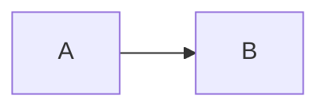

# Markdoc on the public site

This directory is the schema for `@markdoc/next.js` (`schemaPath: ./markdoc`).

## Fences (code blocks)

[Markdoc fence node](https://markdoc.dev/docs/nodes#fence):

- `language` — syntax highlighting label only (CommonMark code fence).
- `process` — when `true` (Markdoc default), `` **inside** the fence are parsed and rendered.

For **quoted** Markdown/Markdoc source (typical in AI-written docs), use a doc language so content stays literal:

````markdown
```md
…
```
````

Languages `md`, `markdown`, `markdoc`, and `mdoc` default to **literal** content on this site (`process` treated as false unless `` is set on the fence line).

## Live components

Use registered tags in the document body, not inside example fences:

````markdown



````

Supported diagram engines: `mermaid`, `d2` (via `type` or fence language).
