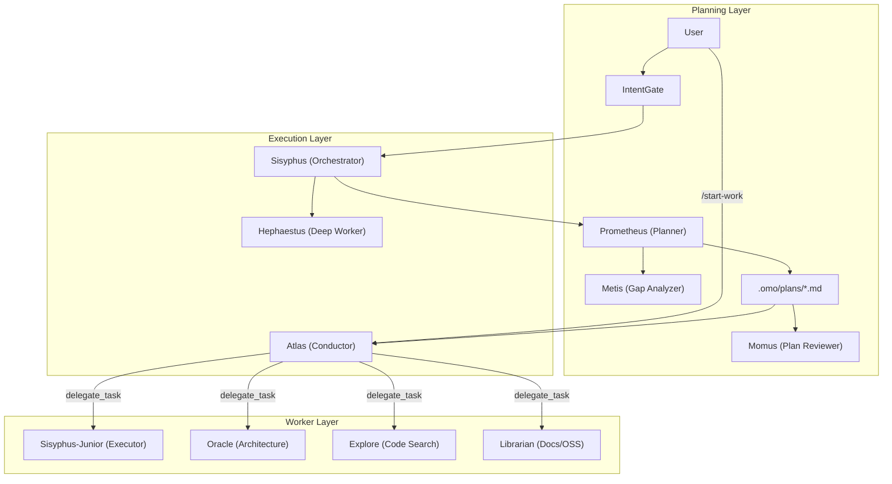

# OSSアーキテクチャ深掘りシリーズ: oh-my-openagent のアーキテクチャと設計思想

## 1. 概要とプロジェクトのビジョン

**oh-my-openagent**（通称 OmO / OMO）は、[OpenCode](https://github.com/sst/opencode) 向けの **Battery-Included エージェントハーネス** である。2026年初頭まで `oh-my-opencode` という名称だったが、GitHub リポジトリは `code-yeongyu/oh-my-openagent` にリネームされ、npm も `oh-my-opencode` と `oh-my-openagent` の **デュアルパブリッシュ** 移行期にある。作者は YeonGyu Kim（`code-yeongyu`）。

調査時点（2026年5月）の規模感: GitHub スター約 59,000、TypeScript ファイル約 2,167、ソース LOC 約 31 万行、リリース v4.2.0。

### 解決する課題

OpenCode は拡張性・カスタマイズ性に優れたターミナル型 AI コーディングエージェントだが、以下の課題がある。

- **マルチモデル編成**を自分で設計・設定する必要がある
- **サブエージェント並列実行**やバックグラウンドタスクの仕組みを一から構築する必要がある
- **LSP / AST-Grep** など IDE 相当のツール群を個別に統合する必要がある
- Claude Code から移行する際の **Commands / Skills / Hooks / MCP 互換** を再現する必要がある
- 単一モデル・単一プロバイダに **ロックイン** される問題

oh-my-openagent はこれらを **1プラグインのインストール** で提供する。「OpenCode 向けの oh-my-zsh」から進化し、現在は **Multi-Harness Agent OS** への再構成（OpenCode / Codex / Pi 等への展開）を ROADMAP で明示している。

### ターゲットユーザー

- OpenCode をメイン開発環境として使う開発者
- Claude Code / Codex CLI / AmpCode から移行し、既存の Skills・Hooks・MCP 資産を活かしたいチーム
- 複数 LLM プロバイダ（Claude / GPT / Gemini / Kimi / Grok 等）を **用途別に編成** したいパワーユーザー
- 「プロンプトを書くだけでタスクが完了する」**Ultrawork** モードを求めるユーザー

### 設計上の核心思想（Ultrawork Manifesto）

| 原則 | 内容 |
|------|------|
| Human Intervention is a Failure Signal | 人間の途中介入は協調ではなく **システムの失敗信号** とみなす |
| Indistinguishable Code | 生成コードはシニアエンジニアのコードと **区別不能** であるべき |
| Token Cost vs. Productivity | トークン増は許容するが、冗長な浪費は避ける |
| Minimize Human Cognitive Load | 人間は「何をしたいか」だけ伝え、あとはエージェントが処理する |
| Predictable, Continuous, Delegatable | コンパイラのように **入力→検証済み出力** が再現可能であること |

ROADMAP ではさらに **「人間はワーカーではない。エージェントがワーカーである」** という立場を明文化している。人間は意図を伝えて去り、エージェントが思考・判断・実行まで完遂する設計が目標である。

---

## 2. システムアーキテクチャ

### 全体像：OpenCode プラグインとしての位置づけ

oh-my-openagent は OpenCode の `@opencode-ai/plugin` インターフェースを実装する **単一エントリプラグイン** である。v4.2 時点では `src/index.ts`（18行）が `createPluginModule()` に委譲し、7ステップの初期化フローを実行する。

```
┌─────────────────────────────────────────────────────────────┐
│                     OpenCode Runtime                         │
│  (Session, Tool Execute, Model Router, LSP, MCP Host)       │
└──────────────────────────┬──────────────────────────────────┘
                           │ @opencode-ai/plugin API (13 handlers)
┌──────────────────────────▼──────────────────────────────────┐
│           oh-my-openagent (createPluginModule)               │
│  ┌─────────────┐ ┌─────────────┐ ┌─────────────────────┐  │
│  │ 54–61 Hooks │ │ 20–39 Tools │ │ 11 Specialized Agents│  │
│  └─────────────┘ └─────────────┘ └─────────────────────┘  │
│  ┌─────────────────────────────────────────────────────┐  │
│  │ IntentGate, Hashline Edit, Team Mode, Background Agent│  │
│  │ Claude Code Compat, Skill Loader, OpenClaw, Boulder   │  │
│  └─────────────────────────────────────────────────────┘  │
└──────────────────────────┬──────────────────────────────────┘
                           │
        ┌──────────────────┼──────────────────┐
        ▼                  ▼                  ▼
   LLM Providers      MCP Servers        Local Tools
 (Claude/GPT/Gemini) (Exa/Context7/LSP)  (Tmux/Hashline)
```

### 初期化フロー（7ステップ）

```
pluginModule.server(input, options)
  ├─→ installAgentSortShim()       # エージェント表示順の正規化
  ├─→ initConfigContext()          # opencode vs openagent レイアウトフラグ
  ├─→ detectExternalSkillPlugin()  # 競合スキルプラグイン警告
  ├─→ injectServerAuthIntoClient()
  ├─→ loadPluginConfig()           # JSONC 多段マージ → Zod v4 検証 → migrate
  ├─→ initializeOpenClaw()         # 外部通知（Discord/Telegram 等）
  ├─→ checkTeamModeDependencies()
  ├─→ createManagers()             # Tmux, Background, SkillMcp, ConfigHandler
  ├─→ createTools()                # ToolRegistry 合成
  ├─→ createHooks()                # 5-tier Hook 合成
  └─→ createPluginInterface()      # 13 OpenCode Hook ハンドラ
```

### 三層オーケストレーション（Planning → Execution → Workers）

中核アーキテクチャは **Prometheus → Atlas → Junior** の三層分離である。



| レイヤー | エージェント | 役割 | モデル例 |
|---------|-------------|------|---------|
| Planning | Prometheus | インタビュー型計画策定 | Claude Opus 4.7 / Kimi K2.6 / GLM 5 |
| Planning | Metis | 曖昧さ・AI-slop パターンの事前検出 | Claude Sonnet 系 |
| Planning | Momus | 計画の厳格レビュー（OKAY/REJECT） | Claude Sonnet 系 |
| Execution | Sisyphus | メインオーケストレータ、並列委譲 | Claude Opus / Kimi K2.6 |
| Execution | Hephaestus | GPT ネイティブ自律深掘りワーカー | GPT-5.5 |
| Execution | Atlas | 指揮・検証・知見蓄積（コードは書かない） | Claude Opus 系 |
| Workers | Sisyphus-Junior | 実装・テスト・LSP 検証 | Category 経由で自動解決 |
| Workers | Oracle / Explore / Librarian 等 | 読み取り専門・探索・調査 | GPT-5.5 / Grok / Gemini 等 |

**Ultrawork モード**（`ultrawork` / `ulw` キーワード）は Planning 層を省略し、Sisyphus が直接並列サブエージェントを起動して完遂まで動く「Just Do It」経路である。

### Team Mode（v4.0、opt-in）

Team Mode は「1エージェント + サブエージェント」から **本格的なマルチエージェントチーム** へ拡張する機能。デフォルト OFF。

- リードエージェント + 最大 8 並列メンバー
- 専用 `team_*` ツール 12 種（`team_create`, `team_send_message`, `team_task_create` 等）
- tmux によるリアルタイム可視化
- ストレージ: `~/.omo/teams/{name}/`（config, state, mailbox, tasklist.jsonl, worktrees）

組み込みスキル例:

- **hyperplan**: 5 つの敵対的批評エージェントが計画を多角的に検証
- **security-research**: 3 脆弱性ハンター + 2 PoC エンジニアが並列監査

### 主要コンポーネント

#### 1. エージェントシステム（`src/agents/`）

11 種類の組み込みエージェント。正規順序: **Sisyphus → Hephaestus → Prometheus → Atlas**（`installAgentSortShim()` で強制）。

- **Sisyphus**: 規律エージェント。TODO 駆動、積極的並列委譲
- **Hephaestus**: GPT-5.5 向け自律深掘りワーカー（レシピではなくゴールを渡す）
- **Prometheus / Metis / Momus**: 計画生成パイプライン
- **Atlas**: `/start-work` 実行時の指揮者
- **Oracle / Librarian / Explore / Multimodal-Looker**: 読み取り・調査特化

#### 2. IntentGate（`keyword-detector` Hook）

ユーザープロンプト実行前に **真の意図**（research / implementation / investigation / fix）を分類する。`ultrawork`/`ulw`、`search`、`analyze`、`team` 等のキーワードでモード別プロンプトを注入する。

#### 3. Hashline Edit（`hashline-core` + `hashline_edit` ツール）

[oh-my-pi](https://github.com/can1357/oh-my-pi) と [The Harness Problem](https://blog.can.ac/2026/02/12/the-harness-problem/) に触発された **コンテンツハッシュ付き行参照** 編集システム。

```
11#VK| function hello() {
22#XJ|   return "world";
33#MB| }
```

`Read` 出力の各行に `LINE#ID` タグが付与され、編集時にハッシュ不一致なら **適用前に拒否**。Grok Code Fast 1 の編集成功率が 6.7% → 68.3% に改善したと報告されている。

#### 4. Hook システム（5-tier 合成）

| Tier | 数 | 例 |
|------|-----|-----|
| Session | 24 | keyword-detector, directory-agents-injector |
| ToolGuard | 16 | write-existing-guard, prometheus-md-only |
| Transform | 5 | context-injector, thinking-block-validator |
| Continuation | 7 | todo-continuation-enforcer, ralph-loop |
| Skill | 2 | skill 関連 |

Team Mode 有効時は +7（計 61 Hook）。`disabled_hooks` で opt-out 可能。

#### 5. ツール群（config-gated）

**常時有効（20）**: LSP 6種、grep/glob、ast_grep、session 4種、background 2種、delegate_task、skill、skill_mcp 等。

**条件付き**: `hashline_edit`（+1）、`interactive_bash`（+1、tmux 必須）、`team_*`（+12）、task system（+4）、`look_at`（+1）。

LSP / AST-Grep は Built-in MCP（`lsp-tools-mcp`, `ast-grep-mcp`）経由でも提供され、OpenCode MCP 名前空間で既存ツール名を維持する。

#### 6. 三層 MCP システム

| Tier | ソース | 内容 |
|------|--------|------|
| 1. Built-in | `src/mcp/` | Exa, Context7, grep_app + ローカル stdio（lsp, ast_grep） |
| 2. Claude Code | `.mcp.json` | `${VAR}` 展開、`mcp_env_allowlist` でセキュリティ制御 |
| 3. Skill-embedded | SKILL.md frontmatter | セッション単位で起動、OAuth 2.0 + PKCE 対応 |

Tier 3 は `${sessionID}:${skillName}:${serverName}` で **セッション分離** される。

#### 7. バックグラウンドエージェント（`src/features/background-agent/`）

`BackgroundManager` + `ParentWakeNotifier`（587行）がタスクのライフサイクル・並行度制御・親セッション復帰を担う。デフォルト `${providerID}/${modelID}` あたり 5 並列、FIFO キュー。

#### 8. OpenClaw 統合（`src/openclaw/`）

Discord / Telegram / HTTP / shell への **双方向** 外部統合。セッションイベントからアウトバウンド通知、インバウンドデーモンが tmux send-keys で返信を注入。

#### 9. Package Layering Refactor（進行中）

ROADMAP 最優先作業。`packages/` をランタイム境界で厳密に分層する。

| Layer | 内容 | 境界 |
|-------|------|------|
| Core | 純 TS ロジック（rules-engine, agents-md-core, hashline-core, boulder-state 等 9+ パッケージ） | ハーネス非依存 |
| MCP | LSP, ast-grep サーバ | stdio プロセス境界 |
| Skills | SKILL.md 静的ファイル | コードなし |
| Adapters | OpenCode プラグイン、将来 Pi/Codex 拡張 | Core を薄くラップ |
| Platform | Bun compile バイナリ 11 プラットフォーム | デプロイ成果物 |
| Web | マーケティングサイト（Next.js 15 + Cloudflare） | 独立アプリ |

**依存ルール**: DAG は下向きのみ。Adapters → Core/MCP/Skills。Adapters に依存するものはない。

---

## 3. 設計思想と開発の原則

### 3.1 「ハーネス内容」をプラグインに集約する設計

OpenCode 本体は **拡張ポイント（機構）** を提供し、oh-my-openagent はその上に **50種類以上の具体ポリシー** を載せる。Framework / Harness / Gateway 三層モデルにおける **Harness 層** に相当する。

ROADMAP は OpenCode を「唯一の中心」ではなく **1つの Adapter ターゲット** と位置づける。`session.prompt` / `session.promptAsync` が durably accept 前に return し、複数 Hook が同一 idle/error エッジを観測して **重複注入・無限ループ** を起こす等、プラグイン API の構造的リスクを明示的に認識している。

### 3.2 表現階層の優先順位

ROADMAP で定義された **エージェント性能最優先** の表現階層:

1. **Skill**（静的知識、ランタイムコストゼロ）
2. **MCP**（外部ツール、プロセス境界）
3. **Tool**（ファーストパーティランタイム能力）
4. **Hook**（エージェントループへの注入）

「人間が読みやすいファイル構成」より **エージェントの推論負荷を減らす表現** を優先する。

### 3.3 関心の分離：Planning / Orchestration / Execution

| 層 | 知能の使い所 | コードを書くか |
|----|-------------|--------------|
| Prometheus | 高次推論・インタビュー | No（計画 MD のみ） |
| Atlas | 調整・検証・知見統合 | No（read/verify のみ） |
| Hephaestus / Junior | 忠実な実装 | Yes |

### 3.4 Category システム：モデル名ではなく意図で委譲

`delegate_task` は **セマンティックカテゴリ**（`ultrabrain`, `visual-engineering`, `deep`, `quick`, `artistry`, `writing` 等）で委譲する。

| Category | 用途 | デフォルトモデル例 |
|----------|------|-------------------|
| ultrabrain | 難解ロジック・アーキテクチャ | GPT-5.5 xhigh |
| visual-engineering | フロントエンド/UI | Gemini 3.1 Pro |
| deep | 自律調査 + 実行 | GPT-5.5 medium |
| quick | 単一ファイル修正 | GPT-5.4 Mini |
| artistry | クリエイティブ | Gemini 3.1 Pro |

### 3.5 Trust But Verify

Atlas はサブエージェントの完了報告を **決して信用しない**。`lsp_diagnostics`（プロジェクト全体）、テストスイート、変更ファイルの実読で独立検証する。

### 3.6 prompt-async-gate（アーキテクチャ不変条件）

内部メッセージ注入は `src/shared/prompt-async-gate.ts` 経由のみ許可。生の `session.prompt` / `session.promptAsync` は監査テスト（`prompt-async-route-audit.test.ts`）で禁止される。セッションあたりの予約、post-dispatch hold、重複注入の回帰テストが必須。

### 3.7 Multi-Harness 方針（慎重な楽観）

Codex / Pi / Claude Code 等への展開は **Exploratory**。過度な統一プラグイン抽象化は Non-Goal。「各コンポーネントが何をするかは Markdown で表現し、interface 定義にはしない」という方針。

---

## 4. プロジェクト構造とコーディング規約

### ディレクトリ構成（v4.2.0）

```
oh-my-openagent/
├── src/
│   ├── index.ts              # 18行ラッパー → createPluginModule()
│   ├── agents/               # 11 AI エージェント
│   ├── hooks/                # 57 ディレクトリ、54–61 Hook
│   ├── tools/                # 13 ネイティブツールディレクトリ
│   ├── features/             # 20 機能モジュール（team-mode, background-agent, openclaw 等）
│   ├── plugin/               # 13 OpenCode Hook ハンドラ + 5-tier 合成
│   ├── plugin-handlers/      # 6-phase 設定パイプライン
│   ├── mcp/                  # 5 Built-in MCP
│   ├── config/               # Zod v4 スキーマ（30 ファイル）
│   ├── cli/                  # install / doctor / run / boulder / mcp-oauth
│   ├── openclaw/             # 外部通知統合
│   ├── shared/               # 297 ユーティリティファイル
│   └── testing/              # create-plugin-module.ts（182行）
├── packages/
│   ├── utils/, model-core/, rules-engine/, agents-md-core/
│   ├── ast-grep-core/, comment-checker-core/, hashline-core/, boulder-state/
│   ├── prompts-core/, lsp-tools-mcp/, ast-grep-mcp/
│   └── web/                  # Next.js 15 マーケティングサイト
├── docs/                     # guide/, reference/, manifesto.md
├── assets/                   # oh-my-opencode.schema.json（Zod 自動生成）
└── .github/workflows/        # CI, publish, CLA, web-deploy 等
```

### 命名・構造規約

| 項目 | 規則 |
|------|------|
| パッケージマネージャ | **Bun のみ**（1.3.12 in CI） |
| 型定義 | `bun-types`（`@types/node` 禁止） |
| 型チェック | `tsgo --noEmit`（`@typescript/native-preview`） |
| ディレクトリ名 | kebab-case |
| Hook 命名 | `createXXXHook(input: PluginInput)` |
| ファイル上限 | 200 LOC ソフトリミット、catch-all ファイル禁止 |
| Barrel exports | 120 個の `index.ts`、ビジネスロジックを index に置かない |
| 設定 | JSONC + Zod v4 + snake_case キー |
| テスト | Bun test、given/when/then、Arrange-Act-Assert 禁止 |

### ワークスペース移行

ランタイム状態は `.sisyphus/` → `.omo/` に移行中。`legacy-workspace-migration.ts` が初回ロード時にコピーする。

---

## 5. 品質保証と導入ツール

### テスト戦略

- **フレームワーク**: Bun 組み込みテストランナー
- **配置**: `*.test.ts` をソースと同階層
- **TDD 必須**: RED → GREEN → REFACTOR
- **メタ監査**: `mock-module-lifecycle-audit.test.ts`、`prompt-async-route-audit.test.ts` が TS Compiler API で全コードベースを走査し、不変条件違反でテスト失敗
- **禁止**: 失敗テストの削除、`as any` / `@ts-ignore` / `@ts-expect-error`

### CI/CD パイプライン

| Workflow | 用途 |
|----------|------|
| `ci.yml` | test + typecheck + build、master push で schema 自動コミット |
| `publish.yml` | デュアル npm publish（oh-my-opencode + oh-my-openagent）+ 11 プラットフォームバイナリ |
| `publish-platform.yml` | `bun compile` によるクロスプラットフォームバイナリ |
| `sisyphus-agent.yml` | @mention で AI が Issue/PR 対応 |
| `refresh-model-capabilities.yml` | models.dev API から週次更新 |
| `web-ci.yml` / `web-deploy.yml` | packages/web の Cloudflare Workers デプロイ |
| `cla.yml` | Contributor License Agreement |
| `lint-workflows.yml` | actionlint |

### PR マージポリシー

- **`dev` への PR は merge commit のみ**（squash / rebase 禁止）
- PR は `master` ではなく `dev` をターゲット

### ビルド・配布

```bash
bun run build
# → dist/index.js (ESM) + dist/index.d.ts
# → assets/oh-my-opencode.schema.json
# → dist/cli/ + 11 platform binaries
```

- npm publish / バージョン bump は **GitHub Actions のみ**
- ライセンス **SUL-1.0**（Server Use License）

---

## 6. まとめと学び

oh-my-openagent から学べるベストプラクティス:

### 6.1 ハーネス設計

1. **機構と内容の分離**: 汎用ランタイムに具体ポリシーをプラグインとして載せ、本体の安定性と機能 richness を両立
2. **Hashline による編集信頼性**: モデルの再現精度問題をハーネス側で解決（Harness Problem への直接回答）
3. **prompt-async-gate**: プラグイン API の非同期欠陥をアプリ層で封じ込める防御的設計
4. **Feedforward + Feedback**: AGENTS.md 注入（事前）+ lsp_diagnostics / comment-checker（事後）

### 6.2 マルチエージェント編成

5. **三層分離 + Hephaestus**: モデル temperaments に合わせた専用エージェント（Claude 系 Sisyphus / GPT 系 Hephaestus）
6. **Category ベース委譲**: プロバイダ非依存の意図ルーティング
7. **Team Mode**: サブエージェントから本格チーム協調への段階的拡張（opt-in）
8. **Wisdom Accumulation**: `.omo/notepads/` によるセッション跨ぎ知見蓄積

### 6.3 エコシステム互換と将来性

9. **Claude Code 完全互換レイヤー**: 移行コスト最小化
10. **Package Layering**: Multi-Harness 展開の前提として Core を純 TS 化
11. **過度な抽象化を避ける**: 業界変化速度に対し Markdown ドキュメント > interface 定義

oh-my-openagent は「LLM を賢くする」のではなく、**エーハーネスを厚くすることで中位モデルでも高品質成果を安定的に出す** 設計の参照実装である。名称変更と Multi-Harness 再構成は、単一ホスト依存から **エージェント OS** への進化を示している。

---

## 参考リンク

- GitHub（調査対象）: https://github.com/code-yeongyu/oh-my-openagent
- npm（移行中デュアルパブリッシュ）: https://www.npmjs.com/package/oh-my-opencode / https://www.npmjs.com/package/oh-my-openagent
- ドキュメント: https://omo.vibetip.help/docs
- DeepWiki: https://deepwiki.com/code-yeongyu/oh-my-openagent
- ROADMAP: https://github.com/code-yeongyu/oh-my-openagent/blob/dev/ROADMAP.md
- Overview: https://github.com/code-yeongyu/oh-my-openagent/blob/dev/docs/guide/overview.md
- Team Mode: https://github.com/code-yeongyu/oh-my-openagent/blob/dev/docs/guide/team-mode.md
- Ultrawork Manifesto: https://github.com/code-yeongyu/oh-my-openagent/blob/dev/docs/manifesto.md
- The Harness Problem: https://blog.can.ac/2026/02/12/the-harness-problem/
- OpenCode 本体: https://github.com/sst/opencode
