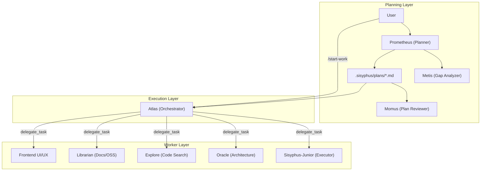

# OSSアーキテクチャ深掘りシリーズ: oh-my-opencode のアーキテクチャと設計思想

## 1. 概要とプロジェクトのビジョン

**oh-my-opencode**（通称 OmO / OMO）は、[OpenCode](https://github.com/sst/opencode) 向けの **Battery-Included プラグイン** である。作者は YeonGyu Kim（`code-yeongyu`）で、npm パッケージ名は `oh-my-opencode`。ユーザー指定の `opensoft/oh-my-opencode` は同一コードベースのフォーク/ミラーであり、調査時点（2026年5月）では upstream の `code-yeongyu/oh-my-opencode` の `dev` ブランチに対し **5435コミット遅れ** の状態だった。アーキテクチャの正本は upstream 側にある。

### 解決する課題

OpenCode は拡張性・カスタマイズ性に優れたターミナル型 AI コーディングエージェントだが、以下の課題がある。

- **マルチモデル編成**を自分で設計・設定する必要がある
- **サブエージェント並列実行**やバックグラウンドタスクの仕組みを一から構築する必要がある
- **LSP / AST-Grep** など IDE 相当のツール群を個別に統合する必要がある
- Claude Code から移行する際の **Commands / Skills / Hooks / MCP 互換** を再現する必要がある

oh-my-opencode はこれらを **1プラグインのインストール** で提供する。「OpenCode 向けの oh-my-zsh」という自己定位で、設定不要のデフォルト動作（Battery Included）と、細かい上書き設定（JSONC）の両立を目指している。

### ターゲットユーザー

- OpenCode をメイン開発環境として使う開発者
- Claude Code / AmpCode から移行し、既存の Skills・Hooks・MCP 資産を活かしたいチーム
- 複数 LLM プロバイダ（Claude / GPT / Gemini / Grok 等）を **用途別に編成** したいパワーユーザー
- 「プロンプトを書くだけでタスクが完了する」**Ultrawork** モードを求めるユーザー

### 設計上の核心思想（Ultrawork Manifesto）

プロジェクトの哲学は [Ultrawork Manifesto](https://github.com/code-yeongyu/oh-my-opencode/blob/dev/docs/ultrawork-manifesto.md) に集約されている。

| 原則 | 内容 |
|------|------|
| Human Intervention is a Failure Signal | 人間の途中介入は協調ではなく **システムの失敗信号** とみなす |
| Indistinguishable Code | 生成コードはシニアエンジニアのコードと **区別不能** であるべき |
| Token Cost vs. Productivity | トークン増は許容するが、冗長な浪費は避ける |
| Minimize Human Cognitive Load | 人間は「何をしたいか」だけ伝え、あとはエージェントが処理する |
| Predictable, Continuous, Delegatable | コンパイラのように **入力→検証済み出力** が再現可能であること |

---

## 2. システムアーキテクチャ

### 全体像：OpenCode プラグインとしての位置づけ

oh-my-opencode は OpenCode の `@opencode-ai/plugin` インターフェースを実装する **単一エントリプラグイン**（`src/index.ts` → `OhMyOpenCodePlugin`）である。OpenCode 本体が提供する **Hook 機構・Tool Registry・Agent 定義・MCP 接続** の上に、OmO 固有のエージェント・ツール・Hook・互換レイヤーを載せる。

```
┌─────────────────────────────────────────────────────────────┐
│                     OpenCode Runtime                         │
│  (Session, Tool Execute, Model Router, LSP, MCP Host)       │
└──────────────────────────┬──────────────────────────────────┘
                           │ @opencode-ai/plugin API
┌──────────────────────────▼──────────────────────────────────┐
│              oh-my-opencode (OhMyOpenCodePlugin)             │
│  ┌─────────────┐ ┌─────────────┐ ┌─────────────────────┐  │
│  │ 31+ Hooks   │ │ 20+ Tools   │ │ 10 Specialized Agents│  │
│  └─────────────┘ └─────────────┘ └─────────────────────┘  │
│  ┌─────────────────────────────────────────────────────┐  │
│  │ Features: Background Agent, Claude Code Compat,     │  │
│  │ Skill Loader, Tmux Sub-Agent, Context Injector      │  │
│  └─────────────────────────────────────────────────────┘  │
└──────────────────────────┬──────────────────────────────────┘
                           │
        ┌──────────────────┼──────────────────┐
        ▼                  ▼                  ▼
   LLM Providers      MCP Servers        Local Tools
 (Claude/GPT/Gemini) (Exa/Context7/...)  (LSP/AST-Grep)
```

### 三層オーケストレーション（Planning → Execution → Workers）

v3.0 以降の中核アーキテクチャは **Prometheus → Atlas → Junior** の三層分離である。



| レイヤー | エージェント | 役割 | モデル例 |
|---------|-------------|------|---------|
| Planning | Prometheus | インタビュー型計画策定 | Claude Opus 4.5 |
| Planning | Metis | 曖昧さ・AI-slop パターンの事前検出 | Claude Sonnet 4.5 |
| Planning | Momus | 計画の厳格レビュー（OKAY/REJECT） | Claude Sonnet 4.5 |
| Execution | Atlas | 指揮・検証・知見蓄積（コードは書かない） | Claude Opus 4.5 |
| Workers | Sisyphus-Junior | 実装・テスト・LSP 検証 | Claude Sonnet 4.5 |
| Workers | Oracle / Explore / Librarian 等 | 読み取り専門・探索・調査 | GPT-5.2 / Grok / GLM 等 |

**Ultrawork モード**（`ultrawork` / `ulw` キーワード）は Planning 層を省略し、Sisyphus が直接並列サブエージェントを起動して完遂まで動く「Just Do It」経路である。

### 主要コンポーネント

#### 1. エージェントシステム（`src/agents/`）

10種類の組み込みエージェントをファクトリパターンで定義。`src/agents/index.ts` の `agentSources` / `builtinAgents` に登録される。

- **Sisyphus**: デフォルトオーケストレータ。TODO 駆動、32k thinking budget、積極的並列委譲
- **Atlas**: `/start-work` 実行時の指揮者（`src/hooks/atlas/` と連携、773行）
- **Prometheus / Metis / Momus**: 計画生成パイプライン
- **Oracle / Librarian / Explore / multimodal-looker**: 読み取り・調査特化

各エージェントは **Provider 優先チェーン** により利用可能なモデルを自動解決する（例: `multimodal-looker` は google → openai → zai → anthropic → opencode の順）。

#### 2. Hook システム（`src/hooks/`）

31以上のライフサイクル Hook が OpenCode のイベント（PreToolUse / PostToolUse / UserPromptSubmit / Stop 等）に介入する。`src/index.ts` で `disabled_hooks` 設定に基づき条件付きで有効化される。

代表的な Hook:

| Hook | イベント | 機能 |
|------|---------|------|
| `keyword-detector` | UserPromptSubmit | `ultrawork`/`ulw`/`search` 等のモード検出 |
| `todo-continuation-enforcer` | Stop | 未完了 TODO がある限り停止を阻止 |
| `directory-agents-injector` | PostToolUse | ファイル読取時に AGENTS.md を自動注入 |
| `atlas` | All | メインオーケストレーションロジック |
| `ralph-loop` | Stop | 自己参照型開発ループの継続管理 |
| `comment-checker` | PostToolUse | 過剰コメントの抑制 |
| `tool-output-truncator` | PostToolUse | grep/LSP 等の出力をコンテキスト窓に応じて切り詰め |
| `claude-code-hooks` | All | Claude Code `settings.json` Hook の実行 |

#### 3. ツール群（`src/tools/`）

| カテゴリ | ツール | 説明 |
|---------|--------|------|
| LSP | `lsp_diagnostics`, `lsp_rename`, `lsp_goto_definition` 等 11種 | IDE 相当のリファクタリング支援 |
| AST | `ast_grep_search`, `ast_grep_replace` | 25言語対応の AST 認識検索・置換 |
| 委譲 | `delegate_task`, `call_omo_agent` | カテゴリ/エージェント指定のサブタスク委譲 |
| バックグラウンド | `background_output`, `background_cancel` | 非同期サブエージェント結果の取得 |
| セッション | `session_list`, `session_read`, `session_search` | 過去セッションの参照・検索 |
| その他 | `grep`, `glob`, `interactive_bash`, `slashcommand`, `skill` | 探索・対話・スキル呼び出し |

#### 4. バックグラウンドエージェント（`src/features/background-agent/`）

`BackgroundManager`（`manager.ts`、1335行）がタスクのライフサイクル・並行度制御・完了通知を担う。プロバイダ/モデルごとに concurrency limit を設定可能。

#### 5. Claude Code 互換レイヤー（`src/features/`）

| 互換対象 | 読み込み元 |
|---------|-----------|
| Commands | `~/.claude/commands/`, `.claude/commands/` |
| Skills | `~/.claude/skills/*/SKILL.md` |
| Agents | `~/.claude/agents/*.md` |
| MCPs | `.mcp.json`, `.claude/.mcp.json`（`${VAR}` 展開対応） |
| Hooks | Claude Code `settings.json` |
| Todos / Transcripts | `~/.claude/todos/`, `~/.claude/transcripts/` |

#### 6. MCP 三層アーキテクチャ（`src/mcp/`）

1. **Built-in MCP**: websearch (Exa), context7 (公式ドキュメント), grep_app (GitHub コード検索)
2. **Claude Code 互換 MCP**: `.mcp.json` からの読み込み
3. **Skill 埋め込み MCP**: SKILL.md の YAML frontmatter 内 `mcp:` 定義

#### 7. 設定システム（`src/config/`）

- **Zod スキーマ**（`schema.ts`）による型安全なバリデーション
- **JSONC 対応**（コメント・末尾カンマ）
- **多段階マージ**: プロジェクト（`.opencode/oh-my-opencode.json`）→ ユーザー（`~/.config/opencode/oh-my-opencode.json`）
- スキーマは `bun run build:schema` で `assets/oh-my-opencode.schema.json` に自動生成

#### 8. CLI（`src/cli/` + `bin/`）

- `oh-my-opencode install`: 対話型インストーラ（プロバイダ検出→最適モデル設定生成）
- `oh-my-opencode doctor`: ヘルスチェック
- マルチプラットフォーム **ネイティブバイナリ**（`packages/darwin-arm64` 等 7 プラットフォーム）を optionalDependencies で配布

### データフロー：典型的な Ultrawork 実行

```
User Prompt ("ulw add auth")
    │
    ▼
keyword-detector Hook ──→ ultrawork モード有効化
    │
    ▼
Sisyphus Agent（メインセッション）
    │
    ├─ delegate_task(category="quick", background=true) ──→ Explore（並列探索）
    ├─ delegate_task(agent="librarian", background=true) ──→ ドキュメント調査
    │
    ├─ directory-agents-injector ──→ AGENTS.md 自動注入
    ├─ LSP/AST-Grep Tools ──→ リファクタリング
    │
    ▼
todo-continuation-enforcer ──→ 未完了なら Stop を阻止
    │
    ▼
comment-checker / lsp_diagnostics ──→ 品質検証
    │
    ▼
session-notification ──→ OS 通知（完了）
```

### Boulder State と Notepad システム

Prometheus + Atlas ワークフローでは、状態がファイルシステムに永続化される。

```
.sisyphus/
├── plans/           # Prometheus が生成した作業計画
└── notepads/{plan}/
    ├── learnings.md      # 成功パターン・規約
    ├── decisions.md      # 設計判断
    ├── issues.md         # 問題・ブロッカー
    ├── verification.md   # テスト結果
    └── problems.md       # 未解決課題
```

Atlas は各タスク完了後に Notepad へ知見を追記し、後続の Junior エージェントへ **Wisdom Accumulation** として引き継ぐ。

---

## 3. 設計思想と開発の原則

### 3.1 「ハーネス内容」をプラグインに集約する設計

OpenCode 本体は **拡張ポイント（機構）** を提供し、oh-my-opencode はその上に **52種類以上の具体ポリシー** を載せる。これは Framework / Harness / Gateway 三層モデルにおける **Harness 層** に相当し、汎用ランタイムと特定目的エージェントの責務分離を体現している。

### 3.2 関心の分離：Planning / Orchestration / Execution

| 層 | 知能の使い所 | コードを書くか |
|----|-------------|--------------|
| Prometheus | 高次推論・インタビュー | No（計画 MD のみ） |
| Atlas | 調整・検証・知見統合 | No（read/verify のみ） |
| Junior | 忠実な実装 | Yes |

「エージェント個の知能」より **システム設計** に intelligence を置く。Junior は Sonnet 級モデルでも、50〜200行の詳細プロンプト + 蓄積知見 + MUST DO/MUST NOT DO 制約により高精度に動作する。

### 3.3 Category システム：モデル名ではなく意図で委譲

`delegate_task` はモデル名（`gpt-5.2`）ではなく **セマンティックカテゴリ**（`ultrabrain`, `visual-engineering`, `quick`）で委譲する。これにより:

- モデル固有の自己認識バイアスを排除
- プロバイダ変更時の設定変更を最小化
- ユーザーは「何をしたいか」だけ指定すればよい

### 3.4 Trust But Verify

Atlas はサブエージェントの完了報告を **決して信用しない**。独立して `lsp_diagnostics`（プロジェクト全体）、テストスイート実行、変更ファイルの実読を行う。

### 3.5 プラグインアーキテクチャ原則

- **Battery Included**: デフォルトですべて有効。`disabled_hooks` / `disabled_skills` で opt-out
- **Factory Pattern**: `createXXXHook(input: PluginInput)`, `createXXXTool()` 命名規則
- **Barrel Exports**: 各モジュール `index.ts` からの re-export
- **Hook は軽量に**: PreToolUse に重いロジックを載せない（全ツール呼び出しのレイテンシに影響）

### 3.6 コミュニティ・ガバナンス

- **CLA 必須**（`.github/workflows/cla.yml`）
- **英語が公式言語**（Issues / PR / ドキュメント）
- **ライセンス SUL-1.0**（Server Use License — 商用 SaaS 利用に制限）
- upstream リポジトリのみ npm publish 可能（`publish.yml` の `if: github.repository == 'code-yeongyu/oh-my-opencode'` ガード）

---

## 4. プロジェクト構造とコーディング規約

### ディレクトリ構成

```
oh-my-opencode/
├── src/
│   ├── index.ts              # プラグインエントリ（601行）
│   ├── agents/               # 10 AI エージェント定義
│   ├── hooks/                # 31+ ライフサイクル Hook
│   ├── tools/                # LSP, AST-Grep, delegate_task 等 20+ ツール
│   ├── features/             # Background Agent, Claude Code 互換, Skill Loader
│   ├── mcp/                  # Built-in MCP 設定
│   ├── config/               # Zod スキーマ, TypeScript 型
│   ├── cli/                  # install / doctor CLI
│   ├── plugin-handlers/      # 設定ハンドラ
│   └── shared/               # 50+ 共通ユーティリティ
├── packages/                 # 7 プラットフォーム別ネイティブバイナリ
├── script/                   # build-schema.ts, build-binaries.ts, publish.ts
├── docs/                     # ガイド, Manifesto, 設定リファレンス
├── assets/                   # JSON Schema, 画像
├── bin/                      # CLI エントリポイント
└── .github/workflows/        # CI, publish, CLA
```

### 命名・構造規約

| 項目 | 規則 |
|------|------|
| パッケージマネージャ | **Bun のみ**（npm/yarn 禁止） |
| 型定義 | `bun-types`（`@types/node` 禁止） |
| ディレクトリ名 | kebab-case（`ast-grep/`, `claude-code-hooks/`） |
| Hook 命名 | `createXXXHook(input: PluginInput)` |
| Tool 構造 | `index.ts`, `types.ts`, `constants.ts`, `tools.ts`, `utils.ts` |
| ビルド | `bun build`（ESM）+ `tsc --emitDeclarationOnly` |
| エクスポート | Barrel pattern（`export * from "./module"`） |
| コードエージェント温度 | 0.1 デフォルト、最大 0.3 |

### 複雑度ホットスポット

| ファイル | 行数 | 役割 |
|---------|------|------|
| `features/background-agent/manager.ts` | 1335 | バックグラウンドタスク管理 |
| `features/builtin-skills/skills.ts` | 1203 | スキル定義 |
| `agents/prometheus-prompt.ts` | 1196 | 計画エージェントプロンプト |
| `tools/delegate-task/tools.ts` | 1039 | カテゴリベース委譲 |
| `hooks/atlas/index.ts` | 773 | オーケストレータ Hook |
| `cli/config-manager.ts` | 664 | JSONC 設定パース |
| `tools/lsp/client.ts` | 596 | LSP JSON-RPC クライアント |

各サブディレクトリには `AGENTS.md` が存在し、モジュール固有のナレッジベースとして機能する（OmO 自身の dogfooding）。

---

## 5. 品質保証と導入ツール

### テスト戦略

- **フレームワーク**: Bun 組み込みテストランナー（`bun test`）
- **テストファイル数**: 約100ファイル（`*.test.ts` をソースと同階層に配置）
- **TDD 必須**（`AGENTS.md` 明記）: RED → GREEN → REFACTOR
- **BDD コメント**: `#given`, `#when`, `#then`
- **禁止**: 失敗テストの削除、`as any` / `@ts-ignore` / `@ts-expect-error`

### 静的解析

- **TypeScript 5.7.3+**: `bun run typecheck`（`tsc --noEmit`）
- 型安全違反の抑制は明示的に禁止

### CI/CD パイプライン

`.github/workflows/ci.yml`:

| Job | 内容 |
|-----|------|
| `test` | `bun install` → `bun test` |
| `typecheck` | `bun run typecheck` |
| `build` | `bun run build` + dist 成果物検証 |
| `draft-release` | dev ブランチ push 時にドラフトリリースノート生成 |

追加ワークフロー:

| Workflow | 用途 |
|----------|------|
| `publish.yml` | workflow_dispatch による npm publish（OIDC provenance） |
| `publish-platform.yml` | 7 プラットフォーム別バイナリパッケージ publish |
| `cla.yml` | Contributor License Agreement チェック |
| `lint-workflows.yml` | GitHub Actions ワークフローの lint |
| `sisyphus-agent.yml` | Sisyphus エージェント関連 CI |

### ビルド・配布

```bash
bun run build
# → dist/index.js (ESM)
# → dist/index.d.ts (型定義)
# → dist/oh-my-opencode.schema.json (Zod → JSON Schema)
# → dist/cli/ (CLI バイナリ)
```

- **npm publish は GitHub Actions のみ**（ローカル `bun publish` 禁止）
- **バージョン管理も CI のみ**（ローカル `package.json` 変更禁止）
- master ブランチ push 時に JSON Schema の自動コミット

### 依存関係の特記事項

| 依存 | 用途 |
|------|------|
| `@opencode-ai/plugin` / `@opencode-ai/sdk` | OpenCode プラグイン API |
| `@ast-grep/napi` | AST 認識コード操作（trusted dependency） |
| `@code-yeongyu/comment-checker` | コメント品質チェック Hook |
| `@modelcontextprotocol/sdk` | MCP クライアント |
| `zod` | 設定スキーマバリデーション |
| `jsonc-parser` | JSONC 設定ファイルパース |

---

## 6. まとめと学び

oh-my-opencode から学べるベストプラクティスを整理する。

### 6.1 ハーネス設計

1. **機構と内容の分離**: 汎用ランタイム（OpenCode）に具体ポリシー（OmO）をプラグインとして載せることで、本体の安定性と機能 richness を両立
2. **Hook による横断的関心事**: コンテキスト注入・出力制限・品質チェック・ループ継続を Hook 1つ1つに分離し、`disabled_hooks` で opt-out 可能に
3. **Feedforward + Feedback**: AGENTS.md 注入（事前）+ lsp_diagnostics / comment-checker（事後）の二方向品質ゲート

### 6.2 マルチエージェント編成

4. **三層分離**: Planning（Prometheus）→ Orchestration（Atlas）→ Execution（Junior）で認知負荷とモデルコストを最適化
5. **Category ベース委譲**: モデル名ではなく意図（`ultrabrain`, `quick`）でルーティングし、プロバイダ非依存性を確保
6. **Wisdom Accumulation**: ファイルベース Notepad でセッション跨ぎの知見を蓄積・引き継ぎ
7. **Trust But Verify**: オーケストレータがサブエージェント報告を独立検証

### 6.3 エコシステム互換

8. **Claude Code 完全互換レイヤー**: Commands / Skills / Hooks / MCP / Todos をそのまま読み込み、移行コストをゼロに
9. **Skill 埋め込み MCP**: スキル定義に MCP サーバを同居させ、ドメイン知識とツールを一体化

### 6.4 開発プロセス

10. **TDD + BDD コメント**: 100テストファイル規模でも品質を維持
11. **AGENTS.md per module**: 大規模コードベースのモジュール境界に AI 向けナレッジを配置（自己 dogfooding）
12. **CI 一元管理**: publish・version bump・schema 更新をすべて GitHub Actions に集約

oh-my-opencode は「LLM を賢くする」のではなく、**エージェント実行基盤（ハーネス）を厚くすることで、中位モデルでも高品質な成果物を安定的に出す** 設計思想の好例である。OpenCode エコシステムにおける **de facto standard プラグイン** として、AI コーディングエージェントのハーネス設計を考える上で重要な参照実装となる。

---

## 参考リンク

- GitHub（調査対象）: https://github.com/opensoft/oh-my-opencode
- GitHub（upstream 正本）: https://github.com/code-yeongyu/oh-my-opencode
- npm: https://www.npmjs.com/package/oh-my-opencode
- DeepWiki: https://deepwiki.com/code-yeongyu/oh-my-opencode
- Overview ドキュメント: https://github.com/code-yeongyu/oh-my-opencode/blob/dev/docs/guide/overview.md
- Orchestration 解説: https://github.com/code-yeongyu/oh-my-opencode/blob/dev/docs/guide/understanding-orchestration-system.md
- Ultrawork Manifesto: https://github.com/code-yeongyu/oh-my-opencode/blob/dev/docs/ultrawork-manifesto.md
- Features リファレンス: https://github.com/code-yeongyu/oh-my-opencode/blob/dev/docs/features.md
- OpenCode 本体: https://github.com/sst/opencode
- OpenCode Plugin API: https://opencode.ai/docs/plugins/
