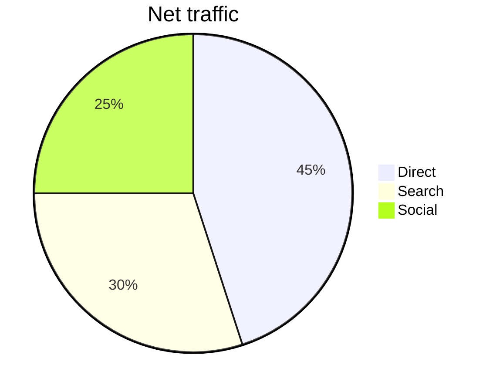

# ターミナルでデータを可視化するOSS CLI・パッケージ・ツール

## 概要

サーバーやSSHセッション、CIログ、データパイプラインの中間結果を「その場で」目で確認したい場面は多い。ブラウザやGUIを開かずに数値の形・分布・推移を把握できるツール群が、ここ10年で急速に成熟した。

本レポートでは、**GitHubスター数や npm/PyPI の利用実績などから「ある程度使われている」もの**に絞り、ターミナル上でデータを可視化するOSSを調査する。色（ANSI 256色・True Color）前提で問題ない。

大きく分けると次の4カテゴリになる。

| カテゴリ | 代表例 | 典型用途 |
|---------|--------|---------|
| **パイプ向けCLI** | YouPlot, termgraph, Miller | CSV/TSVをパイプして即グラフ |
| **Python/JS ライブラリ** | plotext, plotille, asciichart | スクリプト内で描画 |
| **対話型TUI** | VisiData, tickrs, gping, btop | 探索・監視・リアルタイム |
| **インフラ/図表** | gnuplot, Mermaid CLI | 本格描画・ダイアグラム生成 |

描画技術の進化も押さえておくと選びやすい。**ASCII（`*` や `─`）→ Unicodeブロック（`▇` `▄`）→ Braille（`⣿`、解像度8倍）→ ANSIカラー → TUI（画面全体を再描画）** という段階がある。

---

## 背景・歴史

### テキストだけの時代

最古参は **gnuplot**（1986年〜）。もともとPostScriptやX11向けだが、`set terminal dumb` や `ansi256` / `ansirgb` でターミナル出力も可能。科学計算・シェルスクリプト文化の中心に長年存在する。

**spark**（holman/spark, 約6k stars）は2011年頃、シェル一行でミニグラフを出す発想を広めた。出力は `▁▂▃▅▇` の8段階スパークラインのみだが、git log や ping 結果の可視化パターンとして今も参照される。

### UnicodeとBrailleの革命

**drawille**（asciimoo/drawille）は Braille 文字（1文字=2×4ドット）で解像度を上げる低レベル描画エンジン。各言語にポートが乱立した。

その上に **plotille**（tammoippen/plotille, 約515 stars）のように「matplotlib風の高レベルAPI + 軸ラベル」を載せたライブラリが登場。Brailleベースの散布図・ヒストグラム・ヒートマップが可能になった。

### パイプ文化とデータエンジニアリング

**termgraph**（mkaz/termgraph, 約3.3k stars）は2012年から、シンプルなテキストファイルを棒グラフ化するCLIとして定着。**YouPlot**（red-data-tools/YouPlot, 約4.8k stars, 2020年〜）は Ruby 製で、bar/line/scatter/boxplot など統計寄りのグラフを `uplot` コマンド一発で描く。DuckDB 公式ドキュメントでもパイプ先として紹介されている。

**VisiData**（saulpw/visidata, 約9k stars）は2016年〜、スプレッドシート的UIで百万行級CSVを開き、Shift+F で頻度表＋ヒストグラム、`.` で散布図——という「探索的可視化」の代名詞になった。

### モダンPythonエコシステム

**Rich**（Textualize/rich, 約57k stars）自体はグラフ専用ではないが、テーブル・プログレスバー・色付きレイアウトの基盤。**plotext**（piccolomo/plotext, 約2.2k stars）は matplotlib 風APIでターミナルに本格的なチャートを描き、Rich との統合ドキュメントもある。

**Textual**（Textualize/textual, 約37k stars）は TUI フレームワークで Sparkline ウィジェット（`▁▂▃▄▅▆▇█`）を標準提供。ダッシュボード構築の足場になる。

---

## 核となる概念

### 1. 描画解像度（キャラクタセット）

| 方式 | 解像度 | 例 |
|------|--------|-----|
| ASCII | 1×1 | termplotlib + gnuplot の `*` |
| Block Elements | 約4×（半ブロック `▄▀`） | plotext, YouPlot |
| Braille | 約8× | plotille, gping, uniplot |
| Kitty/Sixel 画像 | ピクセル単位 | termplt（Kitty限定）、plotext 画像モード |

### 2. CLI vs ライブラリ vs TUI

- **CLI**: `cat data.csv | uplot bar` — パイプラインの最終段
- **ライブラリ**: Python/JS/Go から `import` — アプリ組み込み
- **TUI**: 全画面・キーバインド・リアルタイム更新 — 監視・探索

### 3. 入力データ形式

多くのツールは **ラベル列 + 数値列**（CSV/TSV/スペース区切り）を想定。VisiData や Miller は JSON・SQLite・Excel なども扱う。

### 4. 色

ANSI エスケープ（8/256/True Color）が主流。termgraph の `--color`、YouPlot の `-c blue`、asciichart の `colors` 配列、gping の `-c` など。ターミナルエミュレータと `$TERM` 設定に依存する点は共通の落とし穴。

---

## 詳細な仕組み・理論

### Braille キャンバスの原理

Braille Unicode（U+2800〜）は各文字が 2列×4行のドット行列。plotille の `Canvas` は幅 \(W\) 文字×高さ \(H\) 文字のキャンバスに対し、実際の描画解像度は \(2W \times 4H\) ドット。参照座標 \((x_{min}, y_{min})\)〜\((x_{max}, y_{max})\) を離散グリッドに写像し、点・線・矩形を Braille に合成する。

### YouPlot のパイプライン設計

YouPlot は内部で **UnicodePlot**（Ruby）を使う。stdin から TSV/CSV を読み、第1列をX軸・第2列以降をY系列と解釈。`-H` でヘッダ、` -d,` で区切り。出力先はデフォルト stderr（パイプを汚さない設計）。DuckDB との典型連携:

```bash
duckdb -s "COPY (SELECT ...) TO '/dev/stdout' WITH (FORMAT csv, HEADER)" \
  | uplot bar -d, -H -t "Top 10"
```

### termplotlib と gnuplot の委譲

termplotlib は **自前で線を引かず gnuplot の dumb/ansi ターミナル出力を借りる**。matplotlib 風 API（`fig.plot`, `fig.hist`, `fig.barh`）の裏で gnuplot プロセスを起動。品質は gnuplot 依存だが、数式プロットや軸ラベルは安定。

### VisiData のグラフモデル

数値列を `#`（int）や `%`（float）に型付けし、`!` でX軸キー列を指定。`.` で単系列散布、`g.` で可視数値列を一括プロット。カテゴリキー列があると色分け散布になる。グラフ画面上で `+`/`-` ズーム、`s`/`t`/`u` で行選択——可視化とデータ操作が一体化している。

---

## 具体例・応用事例

### カテゴリA: パイプ向けCLI（データファイル → グラフ）

#### YouPlot / uplot（★ 約4,766）

- **言語**: Ruby（gem / brew）
- **グラフ種別**: bar, histogram, line, lines（多系列）, scatter, density, boxplot, count
- **色**: `-c` で系列色指定、`colors` サブコマンドでパレット確認
- **パイプ**: 第一級市民。DuckDB・awk・curl と組み合わせやすい

README 掲載の棒グラフ例（概念）:

```
Areas of the World's Major Landmasses
Russia      ████████████████████ ...
Canada      ███████████ ...
...
```

散布図（IRIS データセット）:

```bash
curl -sL https://git.io/IRIStsv | cut -f1-4 | uplot scatter -H -t IRIS
```

**Rust移植**: unicode-plot / youplot クレート群が YouPlot 互換 `uplot` を提供（Lib.rs で紹介）。Ruby 不要環境向け。

---

#### termgraph（★ 約3,285）

- **言語**: Python（`pip install termgraph`）
- **グラフ種別**: 横棒・縦棒・積み上げ・ヒストグラム・カレンダーヒートマップ
- **色**: `--color red blue` 等（ANSI）
- **CLI + Python API** 両対応

README サンプル（実際の出力形式）:

```
2007: ▇▇▇▇▇▇▇▇▇▇▇▇▇▇▇▇▇ 183.32
2008: ▇▇▇▇▇▇▇▇▇▇▇▇▇▇▇▇▇▇▇▇▇▇ 231.23
2009: ▇ 16.43
2011: ▇▇▇▇▇▇▇▇▇▇▇▇▇▇▇▇▇▇▇▇▇▇▇▇▇▇▇▇▇▇▇▇▇▇▇▇▇▇▇▇▇▇▇▇▇▇▇▇▇▇ 508.97
```

絵文字ティック: `--custom-tick "🏃"` で棒を絵文字に差し替え可能（デモ向き）。

---

#### Miller / mlr（★ 約9,941）

厳密には「可視化専用ツール」ではないが、**CSV/JSON 処理の副産物として棒・ヒストグラム**が使える。データジャーナリズム・DevOps で広く利用。

```bash
# 数値列をアスタリスク棒に置換
mlr --csv --opprint bar --auto -f population countries.csv

# ヒストグラム
mlr --csv histogram -f age --auto --nbins 20 people.csv
```

`bar` は「チーズな棒グラフ」（公式コメント通り）だが、ログ集計の即席可視化には十分。

---

### カテゴリB: ライブラリ（スクリプト組み込み）

#### plotext（★ 約2,165 / PyPI 活跃）

- **グラフ種別**: scatter, line, bar, histogram, datetime, candlestick, stem, log, 副プロット, confusion matrix, error bar, 画像/GIF/動画（オプション）
- **特徴**: 依存ゼロ（基本）、matplotlib 風 API、CLI も `python -m plotext`
- **色**: テーマ多数（`plt.theme("pro")` 等）、256色

実際に生成したサイン波ラインプロット（ローカル実行）:

```
                           plotext: Line Plot (sin)
                   ┌───────────────────────────────────────┐
0.00000000000000393┤                                     ▄▞│
                   │                                 ▄▄▀▀  │
0.00000000000000327┤                             ▄▄▀▀      │
                   │                     ▗▄▞▀             │
0.00000000000000000┤▄▄▀▀                                   │
                   └┬─────────┬────────┬─────────┬────────┬┘
                  1.00      1.50     2.00      2.50    3.00
```

```python
import plotext as plt
y = plt.sin(100, 3)
plt.plot(y)
plt.plotsize(60, 15)
plt.title("Daily metric")
plt.show()
```

ヘッドレスサーバーでの EDA、Jupyter なしの quick check に最適。

---

#### plotille（★ 約515）

Braille + 前景/背景色。依存なし。Figure クラスで複数系列・凡例。

ローカル実行サンプル（sin 曲線、Braille）:

```
   (Y)     ^
1.19977506 |
0.99981804 | ⠀⠀⠀⠀⡇⠀⠀⠀⠀⠀⠀⠀⠀⣀⣀⣀⡀⠀⠀⠀⠀⠀⠀⠀⠀...
0.79986101 | ⠀⠀⠀⠀⡇⠀⠀⠀⠀⠀⢀⠔⠉⠀⠀⠀⠈⠑⠢⡀⠀⠀⠀...
3.2917e-05 | ⣀⣀⣀⣀⣗⣁⣀⣀⣀⣀⣀⣀⣀⣀⣀⣀⣀⣀⣀⣀⣀⣀⣀⣈⣢...
-----------|-|---------|---------|---------|---------|---------|-> (X)
```

ヒートマップ・Braille 画像も v4+。

---

#### termplotlib（★ 約719）

gnuplot 必須。line / horizontal・vertical histogram / horizontal bar。

README 掲載の sin プロット（ASCII）:

```
    1 +---------------------------------------+
  0.8 |    **     **                          |
  0.6 |   *         **           data ******* |
  0.4 | **                                    |
  0.2 |*              **                      |
    0 |                 **                    |
 -0.2 |                   **            **    |
   -1 +---------------------------------------+
      0     1    2     3     4     5    6     7
```

横棒:

```
Cats   [ 3]  ************
Dogs   [10]  ****************************************
Cows   [ 5]  ********************
Geese  [ 2]  ********
```

---

#### asciichart（★ 約2,083 / npm 週間DL 約10万）

Node.js 純JS、依存ゼロ。**折れ線のみ**だがマルチ系列・色対応。Python 版 asciichartpy も同リポジトリ系。

```javascript
var asciichart = require('asciichart')
var s0 = new Array(120)
for (var i = 0; i < s0.length; i++)
    s0[i] = 15 * Math.sin(i * ((Math.PI * 4) / s0.length))
console.log(asciichart.plot(s0))
```

README の sin 波は `╭┈╯` 風のボックスドローイング。bitcoin-chart-cli など金融CLIで利用例あり。

---

#### asciigraph（Go, ★ 約3,072）

asciichart の Go ポート + CLI。リアルタイムストリーム `-r` が強力。

```bash
ping -i.2 google.com | grep -oP '(?<=time=).*(?=ms)' --line-buffered \
  | asciigraph -r -g spectrum
```

---

#### uniplot（★ 約456）

Python。Block / Braille / ASCII キャラクタセット選択。CI ログや observability 向け軽量プロット。

---

#### termcharts（PyPI、GitHub 規模は小〜中）

Rich 統合が売り。**pie / doughnut / bar** — ターミナルで円グラフが欲しい rare case 向け。

```python
import termcharts
from rich.panel import Panel
from rich.console import Console
chart = termcharts.pie({"Work": 8, "Sleep": 6, "Play": 4}, rich=True)
Console().print(Panel(chart))
```

---

#### Rich / Textual（★ Rich 約57k / Textual 約37k）

Rich 単体はチャートエンジンではないが、**ProgressBar・Sparkline（Textual ウィジェット）** でダッシュボードの部品になる。plotext / termplotlib / termcharts と組み合わせるのが実践的。

Textual Sparkline は `▁▂▃▄▅▆▇█` と min/max 色のグラデーション。

---

### カテゴリC: 対話型・リアルタイム可視化

#### VisiData（★ 約9,163）

- **入力**: CSV, TSV, JSON, SQLite, Excel, HDF5, Parquet 等
- **可視化**: 頻度表内ヒストグラム（Shift+F）、散布図（`.` / `g.`）、ピボット
- **操作**: フィルタ・派生列・Python 式 — 可視化は探索の一部

頻度表示イメージ（公式 intro より）:

```
OPERATOR           ║ count │ percent │ histogram
UNKNOWN            ║ 23076 │  31.42  │ ■■■■■■■■■■■■■■■■■■■■■■■■■■■■■■■■■■■■■■
AMERICAN AIRLINES  ║  4337 │   5.90  │ ■■■■■■■
DELTA AIRLINES     ║  2817 │   3.84  │ ■■■■
```

データジャーナリズム・オープンデータ調査の定番。

---

#### tickrs（★ 約1,659）

Rust TUI。Yahoo Finance から **line / candle / kagi** チャート、出来高、複数銘柄。金融データのターミナル可視化特化。

```bash
tickrs -s AAPL,MSFT -c candle -t 1M --show-volumes
```

---

#### gping（★ 約12,530）

「Ping, but with a graph」。Braille リアルタイム折れ線。複数ホストを色分け、`--cmd` で任意コマンドの実行時間もグラフ化。

```bash
gping google.com cloudflare.com
gping --cmd "curl -o /dev/null -s -w '%{time_total}' https://example.com"
```

---

#### btop / bpytop（★ btop 約33.5k / bpytop 約10.9k）

システムリソースモニタ。CPU・メモリ・ネットワーク・ディスクの**時系列グラフ**（ブロック/Braille風）。データファイル可視化ではないが、「ターミナルでグラフ」文化の代表例。

---

### カテゴリD: 汎用・図表エンジン

#### gnuplot

あらゆるプロットタイプ（2D/3D/contour/heatmap 等）。ターミナル出力例（dumb + ansi）:

```
  1 +-------------------------------------------------+
0.8 +|||++                   ++||||++                 |
0.6 +|||||||+  sin(x)                                       |
  0 ++++++++++++++++++++++++++++++++++++++++++++++++++|
 -1 +-------------------------------------------------+
    -4       -2        0       2        4        6
```

`set terminal dumb ansi size 60,15` でカラー対応。termplotlib のバックエンドとして現役。

---

#### Mermaid CLI / mmdc（★ 約4,887）

数値グラフではなく **フローチャート・シーケンス図・ガント・円グラフ（pie）** 等のテキスト定義→SVG/PNG。アーキテクチャ図を CLI で生成し、iTerm/Kitty で画像表示するワークフローと相性が良い。

```bash
echo 'pie title Pets
"Cats" : 386
"Dogs" : 141' | mmdc -i - -o pets.svg
```

---

## ツール選定ガイド（用途別）

| やりたいこと | 第一候補 | 理由 |
|-------------|---------|------|
| `sql \| graph` 一発 | **YouPlot** | 統計グラフが揃い、DuckDB 連携実績 |
| 手元のCSVを棒グラフ | **termgraph** | インストール軽い、APIもCLIも |
| Python スクリプト内で本格チャート | **plotext** | 種類豊富、matplotlib 風 |
| Braille 高解像度 | **plotille** / **uniplot** | 散布・ヒスト・ヒートマップ |
| Node/JS パイプライン | **asciichart** | npm 実績大、折れ線特化 |
| Go CLI に折れ線 | **asciigraph** | ストリーム `-r` |
| 百万行CSVを触りながら見る | **VisiData** | 探索+ヒスト+散布 |
| 株価・ローソク足 | **tickrs** | 金融特化 TUI |
| ping/レイテンシ監視 | **gping** | リアルタイム Braille |
| 円グラフ+Rich ダッシュボード | **termcharts** | pie/doughnut 少数派需要 |
| 既存 gnuplot 資産 | **termplotlib** | API だけ Python 化 |
| アーキテクチャ図 | **Mermaid CLI** | テキスト→図 |

---

## 重要人物・文献

| 名前 / プロジェクト | 貢献 |
|-------------------|------|
| **Thomas Williams, Colin Kelley** | gnuplot 原作者 |
| **Zach Holman** | spark — シェルスパークライン文化 |
| **Marcus Kazmierczak** | termgraph |
| **Saul Pwanson** | VisiData |
| **Savino Piccolomo** | plotext |
| **Tammo Ippen** | plotille |
| **Nico Schlömer (nschloe)** | termplotlib, 科学計算CLIエコシステム |
| **Will McGugan / Textualize** | Rich, Textual |
| **red-data-tools** | YouPlot, UnicodePlot |
| **John Kerl** | Miller |
| **Igor Kroitor** | asciichart |
| **Rohit Gupta** | asciigraph (Go) |
| **Tom Forbes (orf)** | gping |

参考書籍・記事として、VisiData 公式ドキュメント、DuckDB YouPlot ガイド、各 README のサンプルが実質的な「マニュアル」になっている。

---

## 最新動向・未解決問題

### 動向

1. **AIエージェント × CLI 可視化**: ターミナル内で動く LLM エージェント向けに、stdout に直接グラフを出すツール（plotext, YouPlot, glyph-arts 等）への関心が高まっている。コンテキストスイッチなしで「数値の形」を LLM に渡せる。
2. **Rust 再実装**: YouPlot → unicode-plot、gping/tickrs/btop など Rust TUI が高性能・配布しやすい。
3. **Rich/Textual 統合**: 単体プロッタより「Rich パネルに embed」する設計が増加。
4. **Braille 標準化**: リアルタイム・高解像度の de facto 方式に。gping の `--simple-graphics` で ASCII フォールバックも用意。
5. **データベース直結**: DuckDB + uplot パターンの普及。SQL 結果をその場で可視化。

### 未解決・限界

- **解像度**: ターミナルは本質的に低解像度。論文品質の図には不向き。
- **インタラクティブ性**: ズーム・ツールチップは VisiData/TUI 系以外弱い。
- **色の再現性**: ログファイルにコピペすると ANSI が崩れる（termgraph README も注意）。
- **ターミナル依存**: Kitty プロトコル（termplt）や Sixel は環境差大。
- **時系列のCLI**: YouPlot は時系列ネイティブ未サポート（README 明記）。plotext の datetime/candlestick や tickrs で補う。
- **3D・地理**: ターミナル 3D はニッチ（termplot-rs 等は star 少）。本格可視化は別ツールへ。

---

## 関連トピック

- **csvkit / xsv / csvtk**: 前処理パートナー
- **GNU datamash**: グループ集計 → uplot
- **DuckDB CLI**: SQL → stdout → プロッター
- **Observable / Jupyter**: ターミナル外だが対比参照に有用
- **chafa / viu**: ターミナル画像表示（グラフではないが可視化スタック）
- **UnicodePlots.jl**: Julia 版ターミナルプロット（HPC 文化）

---

## 参考リンク

- YouPlot: https://github.com/red-data-tools/YouPlot
- UnicodePlot: https://github.com/red-data-tools/unicode_plot.rb
- DuckDB + YouPlot: https://duckdb.org/docs/guides/data_viewers/youplot
- termgraph: https://github.com/mkaz/termgraph
- plotext: https://github.com/piccolomo/plotext
- plotille: https://github.com/tammoippen/plotille
- termplotlib: https://github.com/nschloe/termplotlib
- asciichart: https://github.com/kroitor/asciichart
- asciigraph: https://github.com/guptarohit/asciigraph
- uniplot: https://github.com/olavolav/uniplot
- VisiData: https://www.visidata.org/
- Miller: https://miller.readthedocs.io/
- Rich: https://github.com/Textualize/rich
- Textual: https://textual.textualize.io/
- termcharts: https://github.com/Abdur-rahmaanJ/termcharts
- spark: https://github.com/holman/spark
- gping: https://github.com/orf/gping
- tickrs: https://github.com/tarkah/tickrs
- btop: https://github.com/aristocratos/btop
- gnuplot: http://www.gnuplot.info/
- Mermaid CLI: https://github.com/mermaid-js/mermaid-cli
- drawille: https://github.com/asciimoo/drawille
- unicode-plot (Rust): https://lib.rs/crates/unicode-plot

---

## 付録: 主要ツール比較表

| ツール | ★目安 | 種別 | 主なグラフ | 色 | CLI |
|--------|-------|------|-----------|-----|-----|
| YouPlot | 4.8k | Ruby CLI | bar,line,scatter,hist,box,density | ○ | ◎ |
| termgraph | 3.3k | Py CLI/Lib | bar,stacked,hist,calendar | ○ | ◎ |
| plotext | 2.2k | Py Lib | 多数+candlestick+画像 | ○ | △ |
| VisiData | 9.2k | Py TUI | hist,scatter | ○ | ◎ |
| Miller | 9.9k | Go CLI | bar,hist | △ | ◎ |
| asciichart | 2.1k | JS Lib | line | ○ | △ |
| asciigraph | 3.1k | Go Lib/CLI | line | ○ | ○ |
| plotille | 515 | Py Lib | line,scatter,hist,heatmap | ○ | × |
| termplotlib | 719 | Py Lib | line,hist,barh | △ | × |
| gping | 12.5k | Rust CLI | realtime line | ○ | ◎ |
| tickrs | 1.7k | Rust TUI | line,candle,kagi | ○ | ◎ |
| btop | 33.5k | C++ TUI | system graphs | ◎ | ◎ |
| spark | 6.1k | Shell | sparkline | × | ◎ |
| Mermaid CLI | 4.9k | Node CLI | diagram,pie | ◎ | ◎ |
| Rich/Textual | 57k/37k | Py Lib | sparkline,progress | ◎ | △ |

（★は2026年8月時点の GitHub 公開情報に基づく概算。minor ツールは意図的に省略。）

---

## 付録B: 各ツールのグラフサンプル集

公式 README やローカル実行から採取した「実際の見た目」参考。ターミナルフォント・色設定により多少異なる。

### spark（ミニスパークライン）

```bash
spark 0 30 55 80 33 150
# => ▁▂▃▅▂▇
```

git コミット数の可視化（公式サイトより）:

```bash
git shortlog -s | cut -f1 | spark
# => ▁▁▁▁▁▁▁▁▁▁▁▁▁▁▁▁▁▁▁▁▁▁▁▁▃▁▁▁▁▁▁▁▁▂▁▁▅▁▂▁▁▁▂▁▁▁▁▁▁
```

数値列1次元・トレンド確認専用。軸ラベルなし。プロンプトやステータス行に埋め込む用途向き。

### termgraph 四半期売上（ローカル実行）

```
# Quarterly Sales

Jan: ▇▇▇▇▇▇▇▇▇▇▇▇▇▇▇▇▇▇▇▇ 150.00
Feb: ▇▇▇▇▇▇▇▇▇▇▇▇▇▇▇▇▇▇▇▇▇▇▇▇▇▇▇▇▇▇▇ 230.00
Mar: ▇▇▇▇▇▇▇▇▇▇▇▇▇▇▇▇▇▇▇▇▇▇▇▇ 180.00
Apr: ▇▇▇▇▇▇▇▇▇▇▇▇▇▇▇▇▇▇▇▇▇▇▇▇▇▇▇▇▇▇▇▇▇▇▇▇▇▇▇▇ 290.00
May: ▇▇▇▇▇▇▇▇▇▇▇▇▇▇▇▇▇▇▇▇▇▇▇▇▇▇▇▇ 210.00
```

### termplotlib 横棒（README より）

```
Cats   [ 3]  ************
Dogs   [10]  ****************************************
Cows   [ 5]  ********************
Geese  [ 2]  ********
```

### YouPlot 利用パターン（コマンド例）

正規分布ヒストグラム:

```bash
python3 -c "from numpy import random; n=random.randn(10000); print('\n'.join(str(i) for i in n))" \
  | uplot hist --nbins 20
```

正弦波ラインプロット:

```bash
python3 - <<'PY' | uplot line -w 50 -h 15
from math import sin, pi
for i in range(101):
    print(f"{i*pi/50}\t{sin(i*pi/50)}")
PY
```

YouPlot README には bar / hist / line / scatter / density / boxplot それぞれスクリーンショット付き。Unicode ブロック文字で軸・凡例付きの「本格プロット」に近い見た目になる。

### plotext バー・キャンドル（コード例）

```python
import plotext as plt
plt.bar(["Mon","Tue","Wed","Thu","Fri"], [5, 9, 3, 11, 7])
plt.title("Cups of coffee this week")
plt.show()
```

キャンドル足（金融系。yfinance と組み合わせる例が Medium 等に多数）:

```python
import plotext as plt
plt.date_form("d/m/Y")
plt.candlestick(dates, ohlc_data)  # open/high/low/close
plt.theme("dark")
plt.show()
```

### Mermaid pie チャート（テキスト定義）



`mmdc -i chart.mmd -o chart.svg` で SVG 化。ターミナル内インライン表示は chafa 等と組み合わせる。

---

## 付録C: 意図的に除外したツール

以下は star 数・メンテ状況・重複の観点から本レポートの主役から外した（存在は知っておく程度でよい）。

- **terminalplot / termplot（Python 古参）**: plotext/plotille に機能被り
- **bashplotlib**: メンテ停滞気味、termgraph で代替可
- **termplt（Kitty 限定）**: star 数が少なく環境依存が強い
- **termplot-rs（Sabbat-cloud）**: 2026年新作、star 1程度で実績未蓄積
- **glyph-arts**: 29 chart type と謳うが star 0（2026年 fork 系）、エコシステム未成熟
- **fx（antonmedv）**: JSON ビューア（★20k）だがグラフエンジンではない

---

## 付録D: パイプライン実践レシピ

### レシピ1: SQL → 棒グラフ（DuckDB + YouPlot）

```bash
duckdb -c "
  COPY (
    SELECT category, count(*) AS n
    FROM read_csv_auto('events.csv')
    GROUP BY 1 ORDER BY 2 DESC LIMIT 10
  ) TO '/dev/stdout' WITH (FORMAT csv, HEADER)
" | uplot bar -d, -H -t "Top categories"
```

### レシピ2: ログ集計 → Miller 棒

```bash
mlr --csv stats1 -a count -f status -g host access.log \
  | mlr --csv --opprint bar --auto -f count
```

### レシピ3: Python ワンライナー EDA

```bash
python3 -c "
import pandas as pd, plotext as plt
df = pd.read_csv('metrics.csv')
plt.plot(df['time'].tolist(), df['value'].tolist())
plt.show()
"
```

### レシピ4: リアルタイム監視

```bash
# レイテンシ
gping -c green,yellow api.example.com db.example.com

# シェルコマンド実行時間
while true; do
  t=$( { time curl -s -o /dev/null https://api.example.com/health; } 2>&1 | grep real | awk '{print $2}' | tr -d 'ms' )
  echo "$t"
  sleep 1
done | asciigraph -r
```

---

## まとめ

ターミナルデータ可視化 OSS は、**「パイプで即棒グラフ」（YouPlot/termgraph）**、**「Python に matplotlib 風 API」（plotext）**、**「Braille 高解像度」（plotille/gping）**、**「対話探索」（VisiData）** の4強が柱になっている。色付き ANSI 前提なら、2020年代以降のツールはほぼすべてカラー対応済み。

ポッドキャストや口頭説明用に覚えておくとよいのは、**「データが表形式なら VisiData か YouPlot、スクリプトなら plotext、折れ線だけなら asciichart/spark、監視なら gping/btop」** という分岐だ。README に載った ASCII/Unicode サンプルは、導入前の期待値調整に最も役立つ。
